# Apostila Mestre — Segunda Avaliação de Redes de Computadores

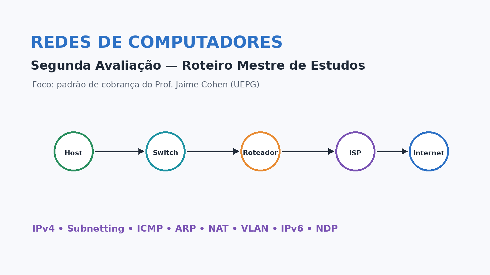

> **Objetivo deste roteiro:** estudar exatamente os conteúdos da Segunda Avaliação, com prioridade para a forma como o Prof. Jaime Cohen formula perguntas. O material usa os questionários Moodle, a lista de autoavaliação e os slides como referência principal.

> **Método recomendado:** teoria → exemplo → questão real/parafraseada → exercício novo → revisão rápida.


> **Objetivo:** estudar exatamente os conteúdos informados pelo professor para a segunda avaliação, usando como base principal os PDFs, slides, tutoriais, links e exercícios enviados na disciplina.
>
> **Como ler esta apostila:** cada seção traz marcações **ENTENDER**, **DECORAR** e **SABER CALCULAR**. Os complementos externos à disciplina aparecem identificados como **Complemento web**.

---

## Como usar esta apostila

Esta apostila foi organizada em três níveis de estudo:

- **ENTENDER:** conceitos que precisam fazer sentido, não apenas ser decorados;
- **DECORAR:** tabelas, faixas e associações que economizam tempo na prova;
- **SABER CALCULAR:** procedimentos que você deve conseguir executar sem consultar material.

> 🎯 **Regra de prioridade:** os slides, tutoriais e exercícios do professor são a referência principal. Fontes da web aparecem apenas como **complemento e verificação técnica**.

> 💡 **Como estudar:** leia a teoria, redesenhe os diagramas principais em uma folha, faça os exemplos de IPv4 sem olhar a resolução e, por fim, utilize a revisão de última hora.

## Sumário

1. [Como priorizar o estudo](#1-como-priorizar-o-estudo)
2. [Introdução às redes e história da Internet](#2-introdução-às-redes-e-história-da-internet)
3. [Arquitetura da Internet: ISPs e Sistemas Autônomos](#3-arquitetura-da-internet-isps-e-sistemas-autônomos)
4. [Comutação de pacotes × comutação de circuitos](#4-comutação-de-pacotes--comutação-de-circuitos)
5. [Pilha de protocolos, PDU e encapsulamento](#5-pilha-de-protocolos-pdu-e-encapsulamento)
6. [Camada de rede: serviços, repasse e roteamento](#6-camada-de-rede-serviços-repasse-e-roteamento)
7. [Arquitetura interna dos roteadores](#7-arquitetura-interna-dos-roteadores)
8. [ICMP, ping e traceroute](#8-icmp-ping-traceroute-tracepath-e-mtr)
9. [IPv4: cabeçalho e fragmentação](#9-ipv4-cabeçalho-e-fragmentação)
10. [Endereçamento IPv4: classes, CIDR e máscaras](#10-endereçamento-ipv4-classes-cidr-e-máscaras)
11. [Subnetting: rede, broadcast, hosts e número de endereços](#11-subnetting-rede-broadcast-hosts-e-número-de-endereços)
12. [VLSM e planejamento de blocos](#12-vlsm-e-planejamento-de-blocos)
13. [Gateway padrão, roteamento estático e tabelas de roteamento](#13-gateway-padrão-roteamento-estático-e-tabelas-de-roteamento)
14. [Casamento do prefixo mais longo](#14-casamento-do-prefixo-mais-longo)
15. [DHCP e obtenção de blocos](#15-dhcp-e-obtenção-de-blocos-de-endereços)
16. [ARP](#16-arp)
17. [IPv4 privados e NAT](#17-ipv4-privados-e-nat)
18. [VLANs e roteamento inter-VLAN](#18-vlans)
19. [IPv6: histórico e motivação](#19-ipv6--histórico-e-motivação)
20. [Notação e tipos de endereços IPv6](#20-notação-e-tipos-de-endereços-ipv6)
21. [Sub-redes IPv6](#21-sub-redes-ipv6)
22. [Cabeçalho IPv6](#22-cabeçalho-ipv6)
23. [IPv4 × IPv6](#23-ipv4--ipv6)
24. [SLAAC](#24-slaac)
25. [NDP — Neighbor Discovery Protocol](#25-ndp--neighbor-discovery-protocol)
26. [Tabela rápida de CIDR](#26-tabela-rápida-de-cidr)
27. [Método rápido para questões de subnetting](#27-método-rápido-para-questões-de-subnetting)
28. [Exercícios resolvidos no estilo do professor](#28-exercícios-resolvidos-no-estilo-do-professor)
29. [Banco de exercícios por tema](#29-banco-de-exercícios-por-tema)
30. [Simulado final — 40 questões](#30-simulado-final--40-questões)
31. [Revisão de última hora e checklist](#31-revisão-de-última-hora-e-checklist)
32. [Fontes e aprofundamento](#32-fontes-e-aprofundamento)

> 🎯 **Regra de estudo:** as questões do Moodle e os exercícios do Prof. Jaime Cohen são a referência principal. Livros e web entram para explicar melhor, não para mudar a terminologia da disciplina.

---

# 1. Como priorizar o estudo

Pelos exercícios já enviados no Moodle, **IPv4 e subnetting merecem prioridade máxima**. O professor já cobrou diretamente:

- quantidade máxima de hosts em uma sub-rede;
- escolha da máscara com menor desperdício;
- endereço de rede;
- broadcast direcionado;
- menor e maior IP válido;
- conversão entre máscara decimal e CIDR;
- identificação de sub-redes em diagramas;
- enlaces ponto a ponto `/30`;
- planejamento de sub-redes com tamanhos diferentes.

### Prioridade sugerida

| Prioridade | Conteúdos |
|---|---|
| **Muito alta** | IPv4, CIDR, máscaras, subnetting, VLSM, broadcast, hosts, `/30`, gateway, tabelas e prefixo mais longo |
| **Alta** | ARP, ICMP, ping, traceroute, DHCP, NAT, VLAN |
| **Média** | arquitetura do roteador, repasse × roteamento, plano de dados × plano de controle, pacotes × circuitos |
| **Revisão conceitual** | história da Internet, ISPs, AS, classificação das redes e pilha/PDU |

---

## Como interpretar as prioridades

Prioridade máxima não significa que os demais assuntos possam ser ignorados. Significa que, se você tiver uma hora de estudo, a maior parte dela deve ser investida em **IPv4, máscaras, subnetting, VLSM e decisões de roteamento**, pois os exercícios reais já mostraram cobrança direta desses procedimentos.

> 🎯 **Padrão já utilizado pelo professor:** o enunciado frequentemente fornece **um IP qualquer dentro da sub-rede**, em vez do endereço da rede, e pede rede, broadcast, primeiro ou último host. Portanto, não basta decorar máscaras: você precisa localizar o bloco que contém o IP.
# 2. Introdução às redes e história da Internet

## 2.1 O que é uma rede de computadores?

Uma rede de computadores é um conjunto de sistemas finais e dispositivos intermediários que conseguem trocar dados por meio de enlaces de comunicação e protocolos.

Nos materiais da disciplina aparecem como componentes físicos e lógicos principais:

- **sistemas finais ou hospedeiros (hosts):** computadores, servidores, celulares, notebooks etc.;
- **enlaces (links):** fibra óptica, cobre, rádio, satélite;
- **comutadores:** switches e roteadores;
- **protocolos:** regras padronizadas que permitem a comunicação entre equipamentos diferentes;
- **redes de redes:** diferentes redes e provedores interligados.

### ENTENDER

A Internet não é “um único grande roteador”. Ela é uma **rede de redes** formada por inúmeros sistemas administrados por organizações diferentes.

## 2.2 Classificações usuais de redes

A classificação pode levar em conta alcance geográfico e contexto de uso.

- **PAN:** rede pessoal, de alcance muito curto.
- **LAN:** rede local, normalmente residência, escritório, prédio ou campus.
- **MAN:** rede metropolitana.
- **WAN:** rede de longa distância, cobrindo cidades, estados, países ou continentes.

Nos materiais, a LAN é destacada por ter normalmente alta taxa de transmissão, baixa latência e administração por uma única pessoa ou organização.

## 2.3 Linha do tempo essencial

### Décadas de 1950–1960

Predomínio de computação centralizada, mainframes e terminais. A comunicação a longa distância usava linhas telefônicas analógicas e os primeiros modems.

### A partir de 1961

Ganham força estudos sobre **comutação de pacotes**, associados nos slides a nomes como Paul Baran, Donald Davies e Leonard Kleinrock.

### 1969 — ARPANET

A ARPANET foi criada com financiamento do governo dos Estados Unidos, interligando universidades e centros de pesquisa. Os comutadores eram chamados de **IMPs (Interface Message Processors)**.

### Anos 1970

- expansão do correio eletrônico;
- FTP;
- outras redes experimentais;
- desenvolvimento do Ethernet;
- propostas de TCP e IP por Vinton Cerf e Robert Kahn.

### 1983 — TCP/IP

A ARPANET passa do NCP para TCP/IP. Nos slides, esse momento é tratado como um marco para a Internet como a conhecemos.

### 1984 — DNS

O DNS introduz uma estrutura hierárquica de nomes, evitando que usuários precisem trabalhar apenas com endereços numéricos.

### Anos 1980–1990

- NSFNET;
- crescimento acadêmico e internacional;
- expansão de backbones;
- conexões acadêmicas no Brasil via FAPESP/RNP;
- surgimento da Web, HTTP, HTML e URLs;
- expansão comercial da Internet.

### DECORAR

- **ARPANET:** 1969.
- **TCP/IP na ARPANET:** 1983.
- **DNS:** década de 1980.
- **Web:** expansão na década de 1990.

---

## 2.4 Visualizando a Internet


Uma distinção útil é **host × switch × roteador**:

- **host:** origem ou destino final dos dados;
- **switch:** normalmente encaminha quadros dentro de uma LAN, usando informações da camada de enlace;
- **roteador:** interliga redes IP diferentes e encaminha datagramas com base em endereços da camada de rede.

### Por que a comutação de pacotes foi tão importante historicamente?

Redes de dados apresentam tráfego em **rajadas**: um computador pode ficar silencioso por algum tempo e depois transmitir rapidamente. Reservar um circuito fixo para cada usuário desperdiçaria capacidade durante os intervalos ociosos. A comutação de pacotes permite multiplexação estatística: usuários compartilham os mesmos enlaces conforme têm dados a enviar.

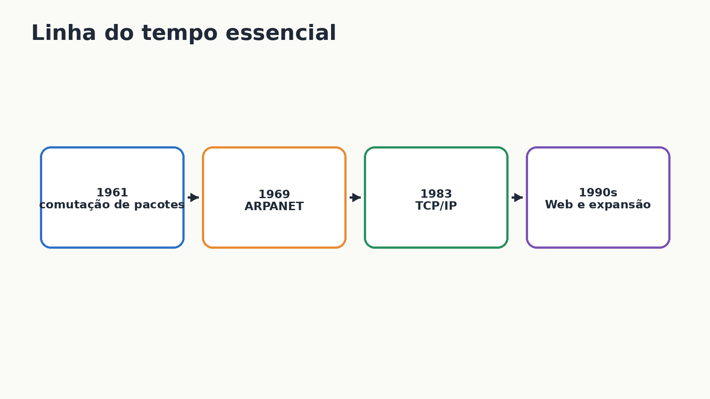

## 2.5 Classificação de redes

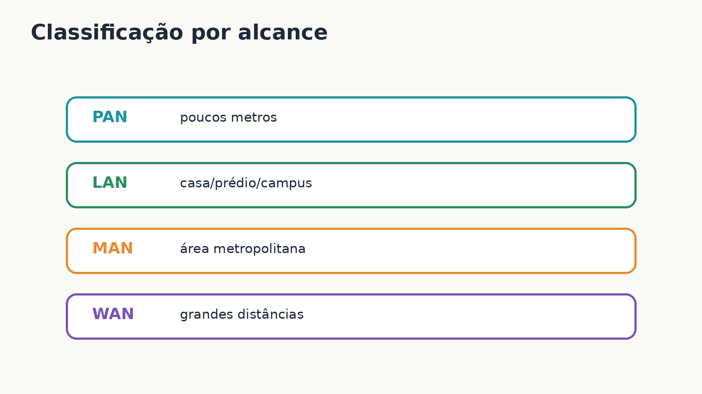

| Sigla | Significado | Alcance típico | Exemplo |
|---|---|---|---|
| PAN | Personal Area Network | poucos metros | Bluetooth entre celular e periférico |
| LAN | Local Area Network | casa, prédio, campus | Ethernet de uma empresa |
| WLAN | Wireless LAN | alcance local sem fio | Wi‑Fi |
| MAN | Metropolitan Area Network | cidade/região metropolitana | rede municipal/metropolitana |
| WAN | Wide Area Network | grandes regiões | rede entre filiais em estados diferentes |

> ⚠️ **Pegadinha:** “Internet” não é simplesmente sinônimo de WAN. Ela é uma **internetwork**, uma rede de redes que inclui inúmeros tipos de redes.


## 🎯 Como o professor já cobrou este tema

Nos exercícios de autoavaliação, o professor parte de definições e pede que você **explique a função da camada de rede e da arquitetura da Internet**, não apenas reconheça palavras. Em prova, espere alternativas que misturem corretamente **host, switch, roteador, enlace, ISP e AS**.

**Treino rápido:**
1. Defina uma rede de computadores sem usar a palavra “Internet”.
2. Diferencie LAN e WAN pela abrangência e administração.
3. Explique por que a Internet é chamada de “rede de redes”.

## Checklist do capítulo

- [ ] Sei definir host, enlace, switch e roteador.
- [ ] Sei explicar por que a Internet é uma rede de redes.
- [ ] Sei associar PAN/LAN/MAN/WAN a exemplos.
- [ ] Sei lembrar ARPANET 1969 e TCP/IP 1983.

## Se eu lembrar apenas de 5 coisas

1. Definir host, enlace, switch e roteador.
2. Explicar por que a Internet é uma rede de redes.
3. Associar PAN/LAN/MAN/WAN a exemplos.
4. Lembrar ARPANET 1969 e TCP/IP 1983.
5. Reconhecer a ideia central e evitar a pegadinha principal.
# 3. Arquitetura da Internet: ISPs e Sistemas Autônomos

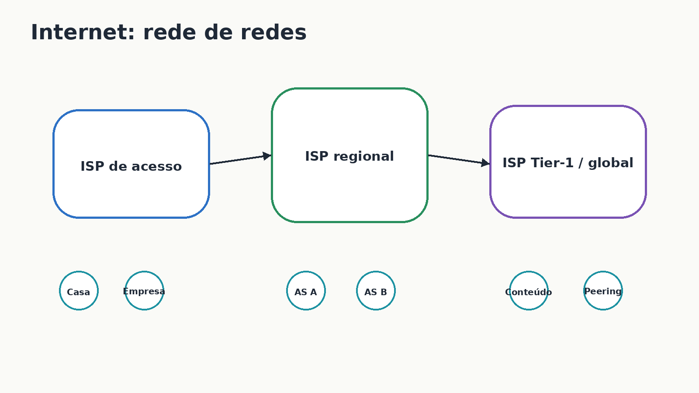

## 3.1 Borda, acesso e núcleo

Uma forma útil de visualizar a Internet é separá-la em:

- **borda:** hosts clientes e servidores;
- **redes de acesso:** conectam os usuários ao provedor;
- **núcleo:** roteadores interconectados que transportam pacotes entre redes.

Tecnologias de acesso citadas nos materiais incluem ADSL, HFC/DOCSIS, fibra (FTTx/FTTH), Wi-Fi, redes celulares e satélite.

## 3.2 ISP

**ISP (Internet Service Provider)** é um provedor que oferece conectividade à Internet.

A estrutura global não é uma árvore rígida. Há:

- provedores de acesso;
- ISPs regionais;
- grandes backbones;
- pontos de troca de tráfego;
- grandes provedores de conteúdo conectados em vários pontos.

## 3.3 Sistema Autônomo — AS

Um **Sistema Autônomo (Autonomous System — AS)** é, nos slides de roteamento, uma coleção de roteadores sob a mesma administração e com uma política de roteamento definida.

Exemplos:

- rede de um ISP;
- rede interna de uma grande empresa;
- rede acadêmica de grande porte.

O roteamento na Internet é hierárquico: existem decisões **dentro de um AS** e **entre ASs**.

### ENTENDER

**ISP** é uma organização/provedor. **AS** é uma unidade lógica de administração e política de roteamento. Um ISP normalmente opera um ou mais ASs.

## Material visual


> **Ideia-chave:** a Internet não possui um “roteador central”. Ela é formada por redes administradas de forma independente, interconectadas por relações de trânsito, peering e pontos de troca de tráfego.


---

## 3.4 AS, IGP e EGP sem decorar além do necessário

Dentro de um AS, uma organização pode utilizar protocolos como **RIP ou OSPF**. Entre Sistemas Autônomos, o protocolo dominante na Internet é o **BGP**. Para esta avaliação, o ponto central é entender **por que o roteamento é hierárquico**: seria impraticável tratar toda a Internet como um único domínio administrativo e executar um único algoritmo global com todos os detalhes internos de todas as redes.

### Analogia

Pense em uma universidade com vários prédios. Para circular **dentro do campus**, você usa regras internas; para ir **de uma universidade a outra**, importa principalmente qual saída leva ao destino. O roteamento intra-AS cuida dos detalhes internos; o inter-AS conecta domínios administrativos.

### Como blocos e ASNs entram nessa arquitetura

A IANA coordena recursos numéricos globais e distribui grandes conjuntos aos Registros Regionais da Internet (RIRs). Na América Latina e Caribe, o RIR é o **LACNIC**. O objetivo é preservar unicidade e permitir agregação.


## 🎯 Como o professor já cobrou este tema

A cobrança costuma ligar **provedores, sistemas autônomos e roteamento**. O importante é saber que um AS é um domínio administrativo e que a Internet precisa de hierarquia para escalar.

**Treino rápido:**
1. O que diferencia um ISP de um AS?
2. Por que não existe um único algoritmo global com todos os detalhes internos da Internet?
3. Associe RIP/OSPF a intra-AS e BGP a inter-AS.

## Checklist do capítulo

- [ ] Sei definir ISP e Sistema Autônomo.
- [ ] Sei diferenciar intra-AS e inter-AS.
- [ ] Sei associar RIP/OSPF ao contexto intra-AS e BGP ao inter-AS.

## Se eu lembrar apenas de 5 coisas

1. Definir ISP e Sistema Autônomo.
2. Diferenciar intra-AS e inter-AS.
3. Associar RIP/OSPF ao contexto intra-AS e BGP ao inter-AS.
4. Reconhecer a ideia central e evitar a pegadinha principal.
5. Reconhecer a ideia central e evitar a pegadinha principal.
# 4. Comutação de pacotes × comutação de circuitos

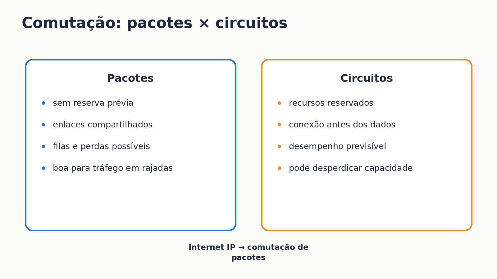

## 4.1 Comutação de pacotes

Na comutação de pacotes, uma mensagem é dividida em unidades menores chamadas **pacotes**. Esses pacotes são enviados pelos enlaces e encaminhados por dispositivos intermediários.

Características importantes dos materiais:

- vários transmissores compartilham os mesmos enlaces;
- não há reserva prévia de toda a capacidade necessária;
- pacotes podem esperar em filas;
- se buffers encherem, podem ocorrer perdas;
- é eficiente para tráfego em rajadas;
- a Internet usa comutação de pacotes.

### Store-and-forward

O material também apresenta o modelo **armazena-e-reenvia (store-and-forward)**: um roteador recebe o pacote e então o encaminha para o próximo enlace.

## 4.2 Comutação de circuitos

Na comutação de circuitos, recursos ao longo de um caminho são reservados durante uma sessão.

Características:

- estabelecimento prévio do caminho/circuito;
- recursos reservados;
- desempenho mais previsível;
- pode haver desperdício quando os recursos reservados ficam ociosos;
- telefonia tradicional é o exemplo clássico.

## 4.3 Comparação

| Aspecto | Pacotes | Circuitos |
|---|---|---|
| Reserva de recursos | não | sim |
| Filas | podem existir | em geral evitadas após reserva adequada |
| Aproveitamento do enlace | alto para tráfego em rajadas | pode haver ociosidade |
| Previsibilidade | menor | maior |
| Estado por conexão no núcleo | não é exigido pelo IP | exigido pelo circuito |
| Internet | modelo dominante | não é o modelo IP básico |

### ENTENDER

A grande vantagem da comutação de pacotes é o **compartilhamento estatístico** dos enlaces. A desvantagem é que o desempenho pode variar com congestionamento.

---

## 4.4 Atraso de transmissão: cálculo que conecta com comutação de pacotes

Se um pacote possui `L` bits e o enlace transmite `R` bits por segundo:

```text
d_trans = L / R
```

Exemplo: pacote de 1.500 bytes em enlace de 10 Mbit/s.

```text
L = 1500 × 8 = 12000 bits
R = 10.000.000 bit/s
d_trans = 12000 / 10.000.000 = 0,0012 s = 1,2 ms
```

Isso é o tempo para **empurrar todos os bits para o enlace**. Não confunda com propagação, que depende da distância e da velocidade do sinal no meio.

> ⚠️ **Pegadinha:** maior largura de banda reduz atraso de **transmissão**, mas não faz o sinal se propagar instantaneamente.


## 🎯 Como o professor já cobrou este tema

O arquivo de autoavaliação pergunta diretamente: **defina comutação de pacotes e de circuitos, liste vantagens e desvantagens e dê exemplos**. Portanto, saiba escrever uma resposta discursiva curta e também reconhecer pegadinhas em múltipla escolha.

**Treino rápido:**
1. Por que a comutação de pacotes aproveita melhor tráfego em rajadas?
2. Qual modelo reserva recursos antes do envio?
3. Em qual modelo filas e perdas por buffer são mais naturais?

## Checklist do capítulo

- [ ] Sei diferenciar pacotes e circuitos.
- [ ] Sei explicar fila e perda.
- [ ] Sei calcular L/R.

## Se eu lembrar apenas de 5 coisas

1. Diferenciar pacotes e circuitos.
2. Explicar fila e perda.
3. Calcular L/R.
4. Reconhecer a ideia central e evitar a pegadinha principal.
5. Reconhecer a ideia central e evitar a pegadinha principal.
# 5. Pilha de protocolos, PDU e encapsulamento

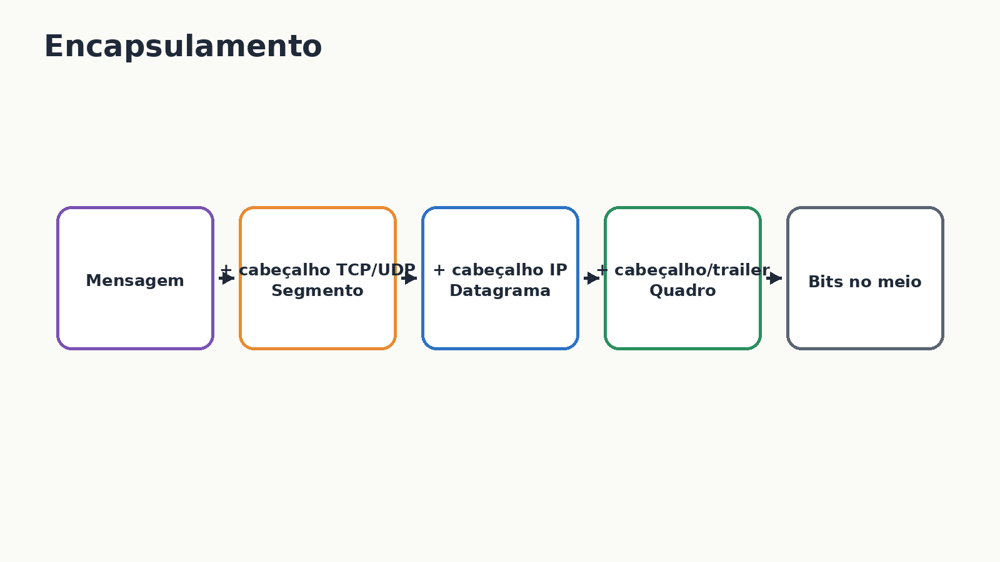

## 5.1 Por que usar camadas?

A arquitetura em camadas organiza uma rede complexa em módulos. Cada camada:

1. executa funções próprias;
2. utiliza os serviços da camada inferior;
3. oferece serviços à camada superior.

Isso facilita projeto, manutenção, interoperabilidade e substituição de tecnologias.

## 5.2 Pilha da Internet

A pilha de cinco camadas trabalhada nos materiais é:

1. **Aplicação**
2. **Transporte**
3. **Rede**
4. **Enlace**
5. **Física**

### Exemplos

| Camada | Exemplos |
|---|---|
| Aplicação | HTTP, SMTP, FTP, DNS |
| Transporte | TCP, UDP |
| Rede | IP, ICMP, protocolos de roteamento |
| Enlace | Ethernet, Wi-Fi, DOCSIS |
| Física | transmissão de bits no meio |

## 5.3 PDU

**PDU (Protocol Data Unit)** é a unidade de dados de uma camada.

### DECORAR

| Camada | Nome da PDU |
|---|---|
| Aplicação | **mensagem** |
| Transporte | **segmento** |
| Rede | **datagrama** ou pacote IP |
| Enlace | **quadro (frame)** |
| Física | **bits** |

## 5.4 Encapsulamento

Ao descer a pilha, cada camada acrescenta informações de controle, normalmente em cabeçalhos.

Exemplo simplificado:

```text
Aplicação:      [ mensagem ]
Transporte: [HT][ mensagem ]
Rede:       [HR][HT][ mensagem ]
Enlace:     [HE][HR][HT][ mensagem ][trailer]
Física: bits transmitidos no meio
```

No destino ocorre o processo inverso: **desencapsulamento**.

### Pegadinha de prova

Roteadores normalmente trabalham até a **camada de rede**: recebem um quadro, extraem o datagrama IP, examinam o cabeçalho IP e depois criam um novo quadro para o enlace seguinte.

---

## 5.5 Visualização completa da pilha

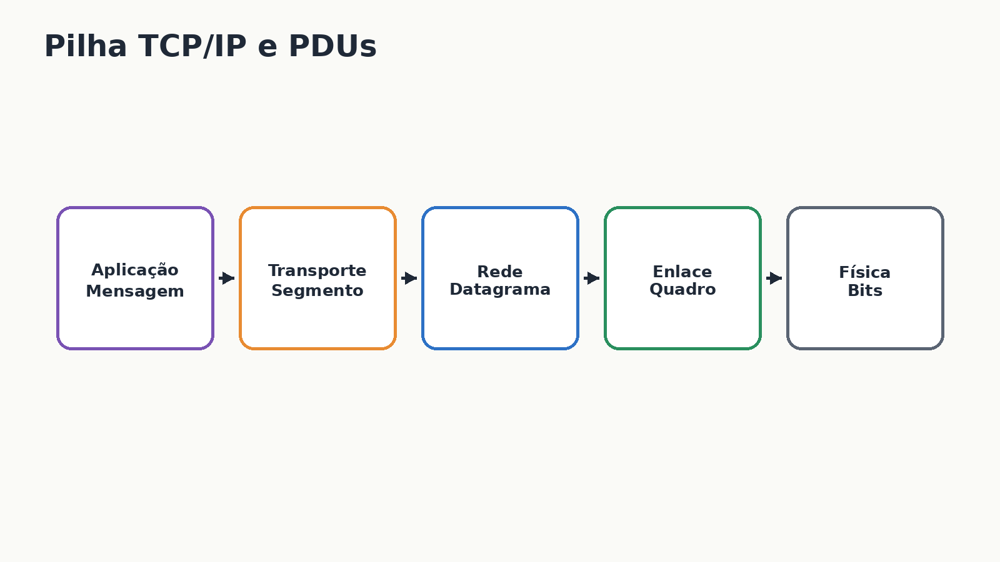


### OSI × arquitetura da Internet

O modelo OSI possui sete camadas; a arquitetura estudada nos materiais usa cinco. A correspondência não é perfeita, mas para revisão:

| OSI | Pilha de 5 camadas |
|---|---|
| Aplicação + Apresentação + Sessão | Aplicação |
| Transporte | Transporte |
| Rede | Rede |
| Enlace | Enlace |
| Física | Física |

> 🧠 **Para memorizar PDU:** **Mensagem → Segmento → Datagrama → Quadro → Bits**.


## 🎯 Como o professor já cobrou este tema

Há uma questão explícita pedindo os nomes das **PDUs das cinco camadas**. Isso é conteúdo de memorização direta.

**Treino rápido:** aplicação → mensagem; transporte → segmento; rede → datagrama/pacote; enlace → quadro; física → bits.

## Checklist do capítulo

- [ ] Sei nomear as cinco camadas.
- [ ] Sei decorar as PDUs.
- [ ] Sei explicar encapsulamento e desencapsulamento.

## Se eu lembrar apenas de 5 coisas

1. Nomear as cinco camadas.
2. Decorar as PDUs.
3. Explicar encapsulamento e desencapsulamento.
4. Reconhecer a ideia central e evitar a pegadinha principal.
5. Reconhecer a ideia central e evitar a pegadinha principal.
# 6. Camada de rede: serviços, repasse e roteamento

## 6.1 Função principal

A camada de rede transfere pacotes entre a origem e o destino, eventualmente passando por vários roteadores.

No material `camada-de-redes-1.pdf`, aparecem duas funções diferentes:

### Repasse / encaminhamento / comutação

Mover um pacote que chegou a uma porta de entrada para a **porta de saída apropriada**.

É uma decisão **local**, tomada no roteador.

### Roteamento

Determinar os **caminhos** que os pacotes usarão na rede.

É associado a algoritmos e protocolos de roteamento.

### DECORAR

> **Repasse = o que fazer com este pacote agora, neste roteador.**  
> **Roteamento = como descobrir os caminhos que devem ser usados.**

## 6.2 Plano de dados × plano de controle

### Plano de dados

- encaminha pacotes;
- consulta a tabela de repasse;
- deve operar rapidamente.

### Plano de controle

- calcula/obtém rotas;
- executa protocolos de roteamento;
- instala informações usadas pelo plano de dados.

Nos slides de roteamento: os protocolos são executados no **plano de controle**, enquanto o encaminhamento ocorre no **plano de dados**.

## 6.3 Serviço de melhor esforço

O IP fornece um serviço de **melhor esforço (best effort)**.

Isso significa que a camada IP não oferece, por si só, garantias de:

- entrega;
- ordem;
- atraso máximo;
- largura de banda mínima;
- ausência de perdas.

Esse desenho segue o princípio fim-a-fim dos materiais: o núcleo da rede é relativamente simples e muitas funções complexas ficam nos sistemas finais.

---

## 6.4 Repasse e roteamento lado a lado

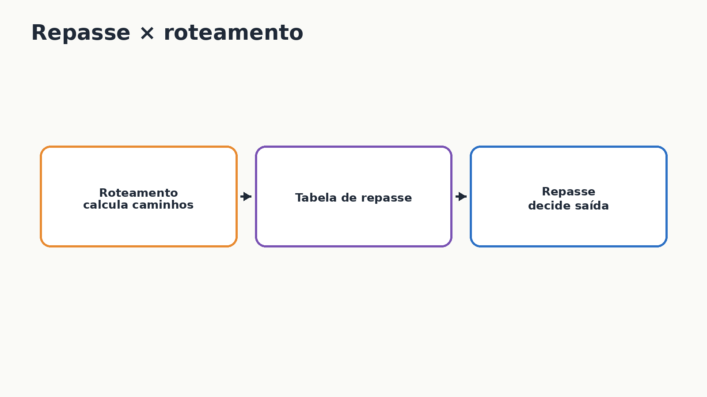

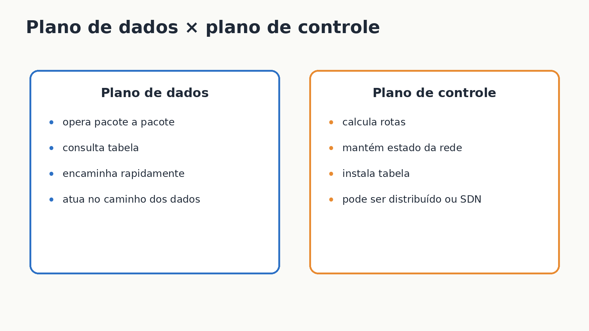

### Exemplo mecânico

1. Um pacote chega à interface `eth0` de R1.
2. O plano de dados lê o endereço IPv4 de destino.
3. Consulta a tabela de repasse.
4. Encontra que o melhor prefixo aponta para `eth2`.
5. O pacote é encaminhado para a saída.

A tabela consultada não surgiu “do nada”: ela é consequência de rotas diretamente conectadas, configuração estática e/ou protocolos do **plano de controle**.

> 🧠 **Para memorizar:** **roteamento cria conhecimento; repasse usa esse conhecimento pacote a pacote.**


## 🎯 Como o professor já cobrou este tema

O professor pergunta a diferença entre **repasse/encaminhamento e roteamento**, e também a diferença entre **plano de dados e plano de controle**. Uma resposta boa precisa deixar claro que repasse é uma decisão local e rápida por pacote; roteamento calcula caminhos e alimenta as tabelas.

## Checklist do capítulo

- [ ] Sei diferenciar repasse e roteamento.
- [ ] Sei diferenciar plano de dados e controle.
- [ ] Sei explicar best effort.

## Se eu lembrar apenas de 5 coisas

1. Diferenciar repasse e roteamento.
2. Diferenciar plano de dados e controle.
3. Explicar best effort.
4. Reconhecer a ideia central e evitar a pegadinha principal.
5. Reconhecer a ideia central e evitar a pegadinha principal.
# 7. Arquitetura interna dos roteadores

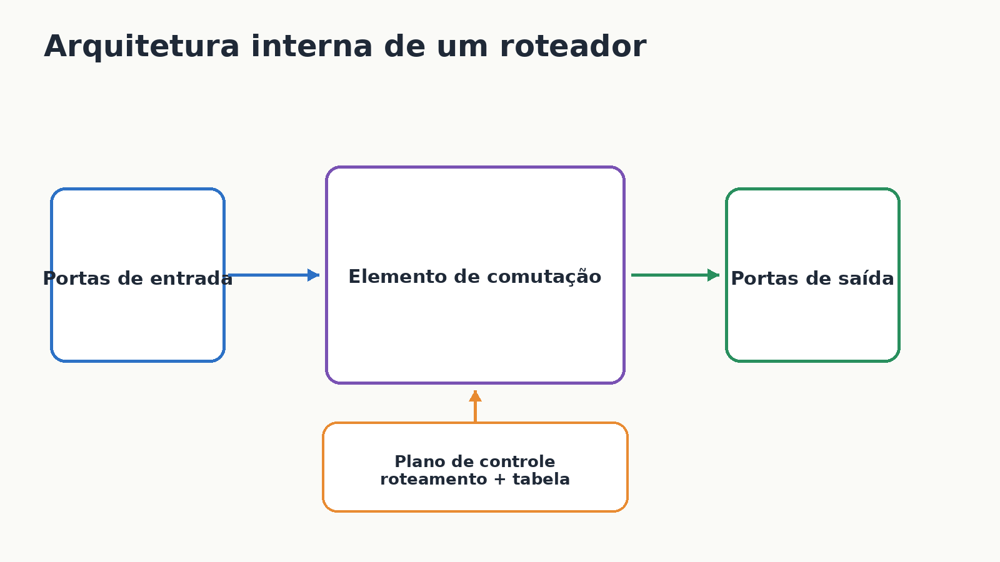

Um roteador possui quatro componentes conceituais importantes:

1. **portas de entrada**;
2. **elemento de comutação**;
3. **portas de saída**;
4. **processador/controle de roteamento**.

## 7.1 Porta de entrada

Funções indicadas nos slides:

- recepção dos bits;
- processamento de enlace/desencapsulamento;
- consulta à tabela de repasse;
- colocação em fila quando necessário.

## 7.2 Elemento de comutação

Conecta entradas a saídas.

Os materiais apresentam arquiteturas históricas/possíveis como:

- comutação via memória;
- via barramento;
- via rede de interconexão/crossbar.

## 7.3 Porta de saída

Recebe pacotes destinados ao enlace correspondente, gerencia filas e transmite os quadros.

Se chegam pacotes mais rapidamente do que a saída consegue transmitir, uma fila cresce. Se o buffer ficar cheio, haverá perda.

## 7.4 Bloqueio HOL

**HOL (Head-of-the-Line)** é o bloqueio em que um pacote na frente de uma fila impede que pacotes atrás dele avancem, mesmo que alguns deles pudessem usar outra saída.

### ENTENDER

Filas não são detalhe “apenas de software”. Elas explicam atraso variável, congestionamento e perda de pacotes.

---

## 7.5 Elementos de comutação

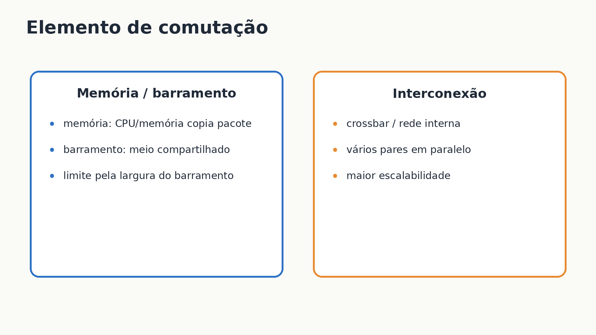

- **Via memória:** típico de arquiteturas antigas; o pacote é copiado para memória e depois para a saída.
- **Via barramento:** várias portas compartilham um bus; o barramento pode virar gargalo.
- **Rede de interconexão/crossbar:** permite maior paralelismo entre entradas e saídas.

### Filas e perda

Se pacotes chegam mais rápido do que podem ser transmitidos, acumulam-se no buffer. Quando o buffer não possui mais espaço, novos pacotes podem ser descartados. Isso conecta a arquitetura do roteador aos conceitos de **fila, congestionamento e perda**.


## 🎯 Como o professor já cobrou este tema

Nos exercícios aparecem perguntas sobre **funções do roteador, porta de entrada, elemento de comutação e tipos de elementos de comutação**. Memorize memória, barramento e rede de interconexão, mas entenda também onde surgem filas e bloqueio HOL.

## Checklist do capítulo

- [ ] Sei identificar porta de entrada, elemento de comutação e saída.
- [ ] Sei explicar filas e bloqueio HOL de forma conceitual.

## Se eu lembrar apenas de 5 coisas

1. Identificar porta de entrada, elemento de comutação e saída.
2. Explicar filas e bloqueio HOL de forma conceitual.
3. Reconhecer a ideia central e evitar a pegadinha principal.
4. Reconhecer a ideia central e evitar a pegadinha principal.
5. Reconhecer a ideia central e evitar a pegadinha principal.
# 8. ICMP, ping, traceroute, tracepath e mtr

## 8.1 ICMP

O **Internet Control Message Protocol (ICMP)** é usado para mensagens de controle, diagnóstico e sinalização de condições da camada de rede.

Nos materiais, mensagens ICMP são transportadas dentro de datagramas IP.

Exemplos importantes:

- **Echo Request**;
- **Echo Reply**;
- **Destination Unreachable**;
- **Time Exceeded**.

## 8.2 ping

O `ping` testa conectividade usando normalmente:

- **ICMP Echo Request — tipo 8, código 0**;
- **ICMP Echo Reply — tipo 0, código 0**.

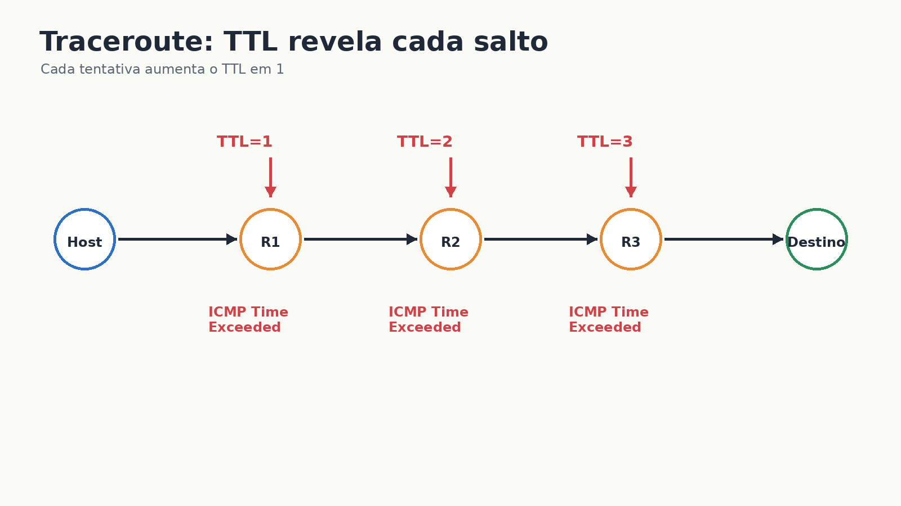

> A figura acima enfatiza traceroute, mas o retorno por ICMP também ajuda a visualizar que mensagens de diagnóstico voltam à origem.

### O que interpretar no resultado

Exemplo típico:

```text
64 bytes from 151.101.3.5: icmp_seq=4 ttl=56 time=28.7 ms
```

- `icmp_seq`: número da sequência;
- `ttl`: TTL observado na resposta;
- `time`: RTT da solicitação/resposta;
- estatística final: pacotes enviados, recebidos, perdas e RTT mínimo/médio/máximo.

### RTT

**RTT (Round-Trip Time)** é o tempo de ida e volta.

### Perda de pacotes

Se o `ping` envia 10 requisições e recebe 8 respostas:

```text
perda = (10 - 8) / 10 × 100% = 20%
```

### Atenção

Falta de resposta ao ping **não prova** que o host está desligado: filtros ou firewalls podem bloquear ICMP.

## 8.3 traceroute


O traceroute tenta revelar os roteadores intermediários manipulando o campo **TTL**.

### Funcionamento

1. envia uma sonda com `TTL = 1`;
2. primeiro roteador decrementa o TTL para 0;
3. descarta o pacote;
4. envia **ICMP Time Exceeded** à origem;
5. traceroute registra o roteador e o RTT;
6. repete com `TTL = 2`, depois 3, 4 etc.

### Por que o TTL existe?

Para impedir que um pacote permaneça circulando indefinidamente em um **loop de roteamento**.

### Linux × Windows

Os materiais destacam que diferentes implementações usam sondas diferentes:

- traceroute clássico Unix: frequentemente UDP;
- `tracert` no Windows: ICMP Echo;
- implementações modernas podem usar UDP, ICMP ou TCP.

## 8.4 Interpretando traceroute corretamente

O material específico sobre traceroute alerta:

- os tempos são **RTT**, não apenas ida;
- o caminho de volta pode ser diferente;
- roteadores podem limitar ou priorizar ICMP;
- um `*` não significa necessariamente perda de todo o tráfego naquele roteador;
- os tempos por salto não precisam crescer monotonamente.

## 8.5 tracepath

`tracepath` também descobre o caminho até o destino e não costuma exigir privilégios especiais. É relacionado ao traceroute e pode auxiliar na descoberta da MTU do caminho.

## 8.6 mtr

O `mtr` combina ideias de ping e traceroute em medições repetidas.

Ele mostra, por salto, dados como:

- perda percentual;
- quantidade enviada;
- último RTT;
- média;
- melhor;
- pior;
- desvio.

### ENTENDER

Um salto que não responde ao ICMP, mas é seguido por saltos que respondem normalmente, **não deve ser interpretado automaticamente como falha naquele roteador**.

---

## 8.0 Antes das ferramentas: atraso, RTT e perda

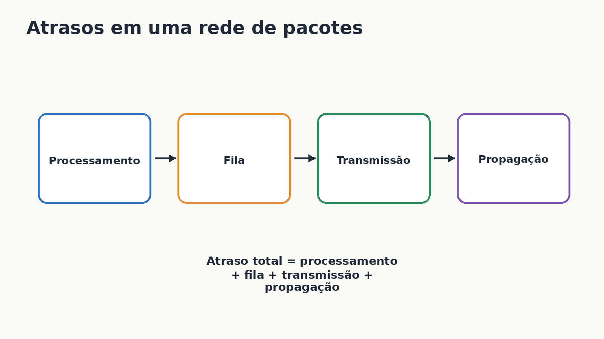

O atraso fim a fim pode incluir:

- **processamento:** examinar cabeçalhos e decidir o que fazer;
- **fila:** esperar por recursos;
- **transmissão:** colocar bits no enlace (`L/R`);
- **propagação:** sinal percorrer o meio (`d/v`).

O **RTT (Round-Trip Time)** mede ida e volta. Ele agrega múltiplos componentes e pode variar entre tentativas.

## 8.2.1 Fluxo visual do ping

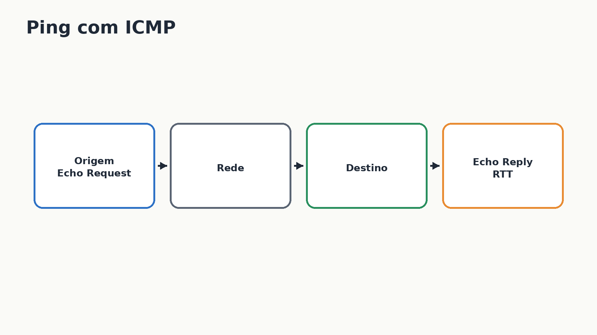

Exemplo de linha típica:

```text
64 bytes from 8.8.8.8: icmp_seq=4 ttl=116 time=18.7 ms
```

- `icmp_seq=4`: sequência da solicitação;
- `ttl=116`: TTL **restante** no pacote de resposta quando chegou ao host;
- `time=18.7 ms`: RTT medido para aquela solicitação.

> ⚠️ **Pegadinha:** o `ttl=` mostrado pelo `ping` não é a quantidade de roteadores do caminho de ida. É o valor restante do TTL da resposta recebida.

## 8.3.1 Fluxo visual do traceroute


No Linux, o método clássico envia sondas UDP para portas improváveis e espera mensagens ICMP. O `traceroute -I` pode usar ICMP Echo; há ainda métodos TCP. O ponto comum é explorar o **TTL** e respostas de erro/controle para revelar saltos.

### Traceroute × tracepath × mtr

| Ferramenta | Ideia principal |
|---|---|
| `traceroute` | mostra saltos e RTTs por TTL; vários métodos de sonda |
| `tracepath` | traça caminho e também procura MTU do caminho; normalmente não exige privilégios especiais |
| `mtr` | combina visão de rota com medições repetidas, útil para observar variação e perda aparente por hop |

> ⚠️ **Interpretação importante:** um roteador intermediário pode limitar ou ignorar respostas ICMP e ainda encaminhar o tráfego normalmente. Por isso, perda mostrada apenas em um hop intermediário não prova perda fim a fim.


## 🎯 Como o professor pode cobrar

Espere interpretação de saída de `ping`/`traceroute` e perguntas conceituais sobre ICMP. A pegadinha clássica é achar que `traceroute` “pergunta o caminho” aos roteadores; na prática ele explora a redução do TTL/Hop Limit e respostas ICMP.

## Checklist do capítulo

- [ ] Sei explicar Echo Request/Reply.
- [ ] Sei explicar TTL e Time Exceeded.
- [ ] Sei interpretar RTT e asterisco no traceroute.
- [ ] Sei diferenciar traceroute, tracepath e mtr.

## Se eu lembrar apenas de 5 coisas

1. Explicar Echo Request/Reply.
2. Explicar TTL e Time Exceeded.
3. Interpretar RTT e asterisco no traceroute.
4. Diferenciar traceroute, tracepath e mtr.
5. Reconhecer a ideia central e evitar a pegadinha principal.
# 9. IPv4: cabeçalho e fragmentação

## 9.1 Datagrama IPv4

O pacote da camada de rede é chamado de **datagrama**.

### Campos importantes do cabeçalho IPv4

- versão;
- IHL/comprimento do cabeçalho;
- tipo/classe de serviço;
- comprimento total;
- identificação;
- flags;
- deslocamento de fragmentação;
- TTL;
- protocolo da camada superior;
- checksum do cabeçalho;
- endereço IPv4 de origem;
- endereço IPv4 de destino;
- opções, quando presentes.

## Material visual — cabeçalho IPv4

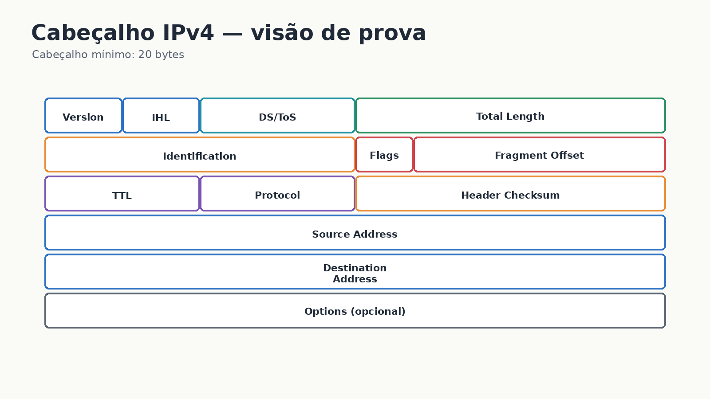

## 9.2 Campos que mais merecem atenção

### Version

Indica a versão do IP. No IPv4, valor 4.

### IHL

Informa o comprimento do cabeçalho em palavras de 32 bits. Um cabeçalho sem opções tem 20 bytes.

### Total Length

Comprimento do datagrama completo: cabeçalho + dados.

### TTL

É decrementado por roteadores. Ao chegar a zero, o pacote é descartado.

### Protocol

Indica qual protocolo deve receber a carga no destino. Nos materiais aparecem exemplos:

- 6 → TCP;
- 17 → UDP.

### Header Checksum

Detecta erros no cabeçalho IPv4 e precisa ser atualizado porque campos como TTL mudam ao longo do caminho.

## 9.3 Fragmentação

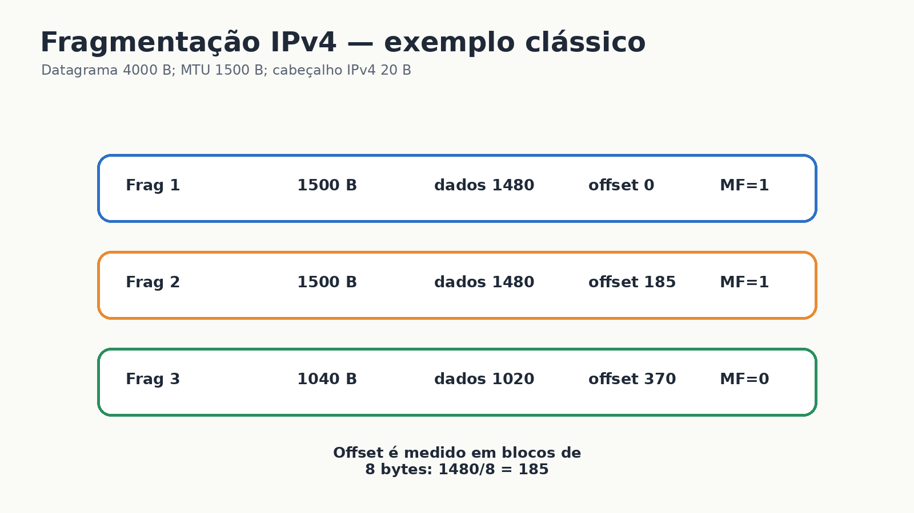

Cada tecnologia de enlace possui uma **MTU (Maximum Transmission Unit)**.

Se um datagrama IPv4 é maior do que a MTU do enlace de saída, ele pode precisar ser fragmentado.

### Campos envolvidos

- **Identification:** igual para fragmentos do mesmo datagrama original;
- **MF (More Fragments):** indica que ainda existem fragmentos depois daquele;
- **Fragment Offset:** posição daquele fragmento no datagrama original, medida em unidades de 8 bytes.

### Remontagem

A remontagem é realizada no **destino final**, não em cada roteador intermediário.

## 9.4 Exemplo clássico dos materiais

Datagrama de 4000 bytes passando por enlace com MTU 1500:

- cabeçalho: 20 bytes;
- primeiro fragmento: 1500 bytes, com 1480 bytes de dados;
- segundo: 1500 bytes, com mais 1480 bytes de dados;
- terceiro: restante.

Offsets:

- primeiro: `0`;
- segundo: `1480 / 8 = 185`;
- terceiro: `(1480 + 1480) / 8 = 370`.

### SABER CALCULAR

Se uma questão de fragmentação aparecer:

1. descubra quantos bytes de dados cabem em cada fragmento;
2. mantenha múltiplo de 8 nos fragmentos que não são o último;
3. calcule offset em unidades de 8 bytes;
4. MF = 1 em todos menos o último.

---

## 9.5 Cabeçalho IPv4 — visão organizada


| Campo | Função que você deve saber |
|---|---|
| Version | identifica a versão do IP; IPv4 = 4 |
| IHL | tamanho do cabeçalho em palavras de 32 bits; mínimo usual = 20 bytes |
| DS/TOS | classificação/serviço do tráfego |
| Total Length | tamanho total: cabeçalho + dados |
| Identification | identifica fragmentos pertencentes ao mesmo datagrama original |
| Flags | inclui DF e MF, relacionados à fragmentação |
| Fragment Offset | posição do fragmento, em unidades de 8 bytes |
| TTL | decrementado a cada roteador; evita circulação indefinida |
| Protocol | indica protocolo carregado: por exemplo TCP=6, UDP=17, ICMP=1 |
| Header Checksum | verifica erros no cabeçalho e muda quando TTL muda |
| Source/Destination | endereços IPv4 de origem e destino final |

### Fragmentação passo a passo


Para um datagrama de 4.000 bytes com cabeçalho de 20 bytes e MTU 1.500:

- cada fragmento completo pode levar `1500 - 20 = 1480` bytes de dados;
- 1480 é múltiplo de 8, requisito importante para calcular offsets;
- offsets: `0`, `1480/8 = 185`, `(1480+1480)/8 = 370`;
- MF = 1 nos fragmentos que ainda têm outros depois; o último usa MF = 0;
- a remontagem ocorre no sistema final de destino.

> 🔎 **Complemento de verificação:** nos slides aparece a expressão ICMP “packet too big” no contexto de descoberta de MTU. Na terminologia clássica do IPv4/RFC 792, o erro correspondente é **Destination Unreachable, code 4: fragmentation needed and DF set**. “Packet Too Big” é o nome formal de uma mensagem do ICMPv6. Para a prova, preserve a terminologia do professor, mas saiba essa diferença.


## 🎯 Como o professor já cobrou este tema

A autoavaliação pede para **listar e explicar os campos IPv4 e IPv6, informar tamanhos dos cabeçalhos, explicar Protocol/Next Header e TTL/Hop Limit**, além de fragmentação. É importante dominar função, não somente o nome dos campos.

## Checklist do capítulo

- [ ] Sei identificar campos importantes do cabeçalho IPv4.
- [ ] Sei explicar MTU e fragmentação.
- [ ] Sei calcular offsets simples.

## Se eu lembrar apenas de 5 coisas

1. Identificar campos importantes do cabeçalho IPv4.
2. Explicar MTU e fragmentação.
3. Calcular offsets simples.
4. Reconhecer a ideia central e evitar a pegadinha principal.
5. Reconhecer a ideia central e evitar a pegadinha principal.
# 10. Endereçamento IPv4: classes, CIDR e máscaras

## 10.1 Endereço IPv4

Um IPv4 possui **32 bits**, normalmente representados em quatro octetos decimais:

```text
192.168.1.10
```

Cada octeto varia de 0 a 255.

### Importantíssimo

O endereço IP é associado a uma **interface de rede**, não conceitualmente ao equipamento inteiro. Um roteador com várias interfaces terá vários endereços IP.

## 10.2 Parte de rede e parte de host

Um endereço contém:

- **prefixo:** identifica rede/sub-rede;
- **sufixo:** identifica interface dentro daquela sub-rede.

O tamanho do prefixo é indicado por `/n`.

Exemplo:

```text
192.168.1.0/24
```

- 24 bits de rede;
- 8 bits de host.

## 10.3 Endereçamento por classes — histórico

O modelo antigo era classful.

| Classe | Prefixo tradicional | Uso básico |
|---|---:|---|
| A | /8 | redes muito grandes |
| B | /16 | redes médias |
| C | /24 | redes menores |
| D | — | multicast |
| E | — | reservado/experimental |

### ENTENDER

As classes A/B/C foram substituídas pelo **CIDR**, que permite prefixos de tamanho arbitrário.

## 10.4 CIDR

**CIDR — Classless Inter-Domain Routing** usa o formato:

```text
A.B.C.D/x
```

`x` é o número de bits do prefixo.

Exemplo:

```text
200.23.16.0/23
```

Aqui há:

- 23 bits de rede;
- 9 bits de host.

## 10.5 Máscara decimal

O `/x` pode ser representado por uma máscara decimal.

Exemplos:

```text
/24 = 255.255.255.0
/25 = 255.255.255.128
/26 = 255.255.255.192
/27 = 255.255.255.224
/28 = 255.255.255.240
/29 = 255.255.255.248
/30 = 255.255.255.252
```

## 10.6 Como converter máscara decimal para CIDR

Conte quantos bits `1` existem na máscara.

Exemplo:

```text
255.128.0.0
```

- 255 = 8 bits `1`;
- 128 = `10000000` = 1 bit `1`;
- total = 9.

Resultado:

```text
/9
```

Esse formato foi cobrado diretamente nos exercícios do professor.

---

## 10.7 CIDR visual: bits de rede e bits de host

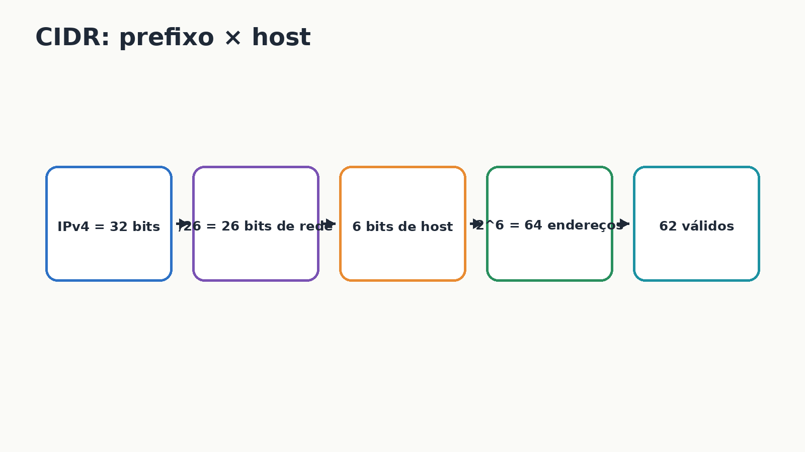

### Conversão decimal ↔ binário que realmente ajuda

Cada octeto possui pesos:

```text
128 64 32 16 8 4 2 1
```

Exemplo: `224 = 128 + 64 + 32`, logo:

```text
224 = 11100000
```

Uma máscara `/27` possui 27 bits `1`:

```text
11111111.11111111.11111111.11100000
255      255      255      224
```

### Classes históricas

| Classe | Primeiro octeto (visão histórica) | Prefixo padrão histórico | Uso |
|---|---:|---:|---|
| A | 1–126 | /8 | unicast |
| B | 128–191 | /16 | unicast |
| C | 192–223 | /24 | unicast |
| D | 224–239 | — | multicast |
| E | 240–255 | — | reservado/experimental |

> ⚠️ **Cuidado:** CIDR substituiu o uso operacional de classes A/B/C. Hoje um endereço começando com 10, por exemplo, pode estar em um prefixo `/20`, `/23`, `/30` etc., conforme a rede configurada.


## 🎯 Como o professor já cobrou este tema

As questões pedem 32 bits, prefixo/sufixo, CIDR, formas de representar máscaras, obtenção de endereços, tipos de endereços IPv4 e conversão decimal ↔ binário.

## Checklist do capítulo

- [ ] Sei converter CIDR e máscara.
- [ ] Sei explicar rede x host.
- [ ] Sei entender classes como modelo histórico.

## Se eu lembrar apenas de 5 coisas

1. Converter CIDR e máscara.
2. Explicar rede x host.
3. Entender classes como modelo histórico.
4. Reconhecer a ideia central e evitar a pegadinha principal.
5. Reconhecer a ideia central e evitar a pegadinha principal.
# 11. Subnetting: rede, broadcast, hosts e número de endereços

Esta é a parte mais importante para cálculo.

## 11.1 Fórmulas fundamentais

Se o prefixo é `/p`:

```text
bits de host = 32 - p
endereços totais = 2^(bits de host)
hosts válidos = 2^(bits de host) - 2
```

A regra `-2` considera:

- endereço de rede;
- broadcast direcionado.

### Exemplo — /23

```text
bits de host = 32 - 23 = 9
endereços = 2^9 = 512
hosts válidos = 512 - 2 = 510
```

Isso corresponde a uma questão real já aplicada pelo professor.

## 11.2 Endereço de rede

É o endereço em que todos os bits de host são `0`.

Exemplo:

```text
192.168.1.128/25
```

Rede:

```text
192.168.1.128
```

## 11.3 Broadcast direcionado

É o endereço em que todos os bits de host são `1`.

Exemplo:

```text
192.168.1.128/25
```

Intervalo:

```text
192.168.1.128 até 192.168.1.255
```

Broadcast:

```text
192.168.1.255
```

## 11.4 Primeiro e último IP válido

```text
primeiro host = rede + 1
último host = broadcast - 1
```

## 11.5 Técnica do “tamanho do bloco”

Quando o prefixo não termina em fronteira de octeto, identifique o octeto relevante.

Exemplo:

```text
/27 = 255.255.255.224
```

Tamanho do bloco:

```text
256 - 224 = 32
```

As redes começam em:

```text
0, 32, 64, 96, 128, 160, 192, 224
```

### Exemplo real do professor

IP:

```text
192.168.222.150
```

Máscara:

```text
255.255.255.224 = /27
```

150 pertence ao bloco:

```text
128–159
```

Então:

```text
Rede:          192.168.222.128
Primeiro:      192.168.222.129
Último válido: 192.168.222.158
Broadcast:     192.168.222.159
```

## 11.6 Quando o bloco atravessa o terceiro octeto

### Exemplo — /23

```text
/23 = 255.255.254.0
```

Tamanho do bloco no terceiro octeto:

```text
256 - 254 = 2
```

As redes iniciam em terceiro octeto par:

```text
0, 2, 4, ..., 172, 174, ...
```

Para:

```text
172.31.173.245/23
```

173 pertence ao bloco `172–173`.

```text
Rede:          172.31.172.0
Primeiro:      172.31.172.1
Último válido: 172.31.173.254
Broadcast:     172.31.173.255
```

## 11.7 /20

```text
/20 = 255.255.240.0
```

Tamanho do bloco no terceiro octeto:

```text
256 - 240 = 16
```

Inícios:

```text
0, 16, 32, 48, 64, ...
```

Se o IP possui terceiro octeto 32, o bloco é:

```text
32 até 47
```

Logo, para `10.235.32.191/20`:

```text
Broadcast = 10.235.47.255
```

Esse também é um exemplo já cobrado pelo professor.

---

## 11.8 Método visual do bloco

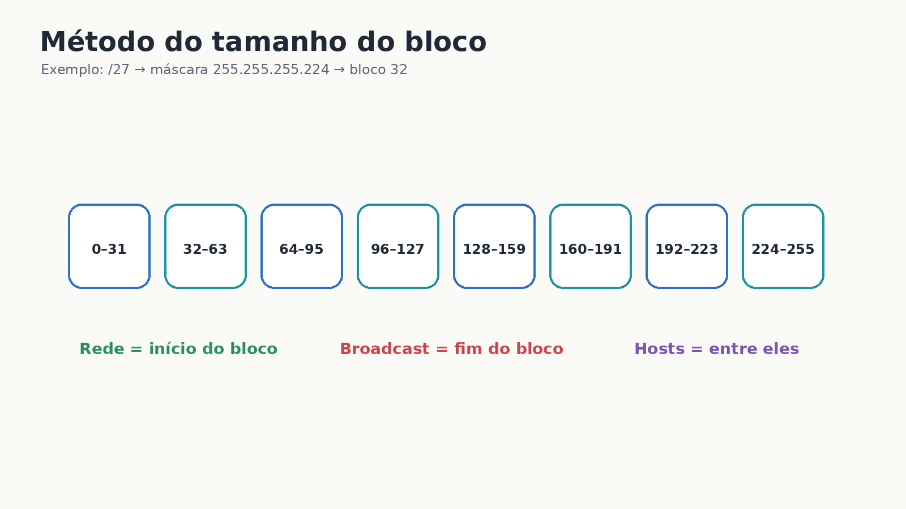


### Escolhendo máscara a partir da quantidade de hosts

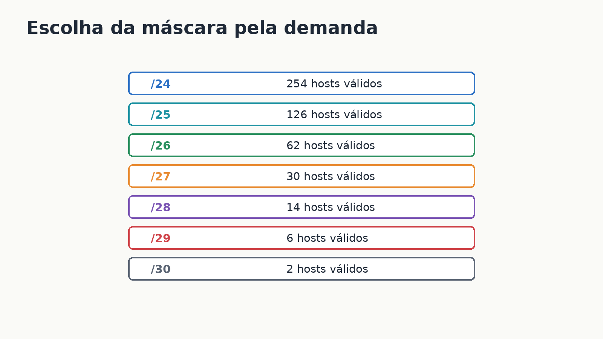

Se são necessários `N` hosts, procure o menor número de bits de host `h` que satisfaça:

```text
2^h - 2 >= N
```

Depois:

```text
prefixo = 32 - h
```

Exemplo para 150 hosts:

- 7 bits: `2^7 - 2 = 126` → não basta;
- 8 bits: `2^8 - 2 = 254` → basta;
- prefixo = `32 - 8 = /24`.

### /30 em enlace ponto a ponto

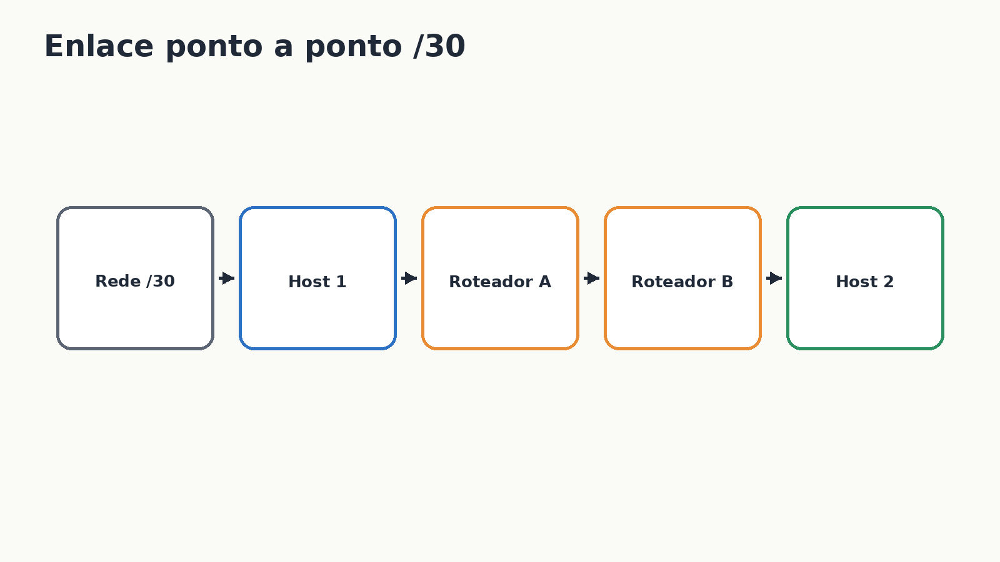

> 🎯 **Padrão já utilizado pelo professor:** com `/30`, aparecem blocos de 4 em 4. No modelo clássico cobrado, há rede, dois hosts válidos e broadcast.


## 🎯 Como o professor já cobrou este tema

No Moodle, o padrão é recorrente: fornece **um IP qualquer dentro da sub-rede** e pede broadcast, primeiro/último válido ou rede. Exemplos reais: `/23 → 510 interfaces`, menor máscara para 10 hosts → `/28`, e broadcast de `10.235.32.191/20` → `10.235.47.255`.

> 🧮 **SABER CALCULAR:** não basta decorar tabela; localize o bloco que contém o IP.

## Checklist do capítulo

- [ ] Sei calcular total e hosts válidos.
- [ ] Sei encontrar rede e broadcast.
- [ ] Sei encontrar primeiro e último host.
- [ ] Sei escolher máscara por quantidade de hosts.
- [ ] Sei resolver /30.

## Se eu lembrar apenas de 5 coisas

1. Calcular total e hosts válidos.
2. Encontrar rede e broadcast.
3. Encontrar primeiro e último host.
4. Escolher máscara por quantidade de hosts.
5. Resolver /30.
# 12. VLSM e planejamento de blocos

**VLSM (Variable Length Subnet Mask)** permite usar máscaras diferentes para sub-redes de tamanhos diferentes.

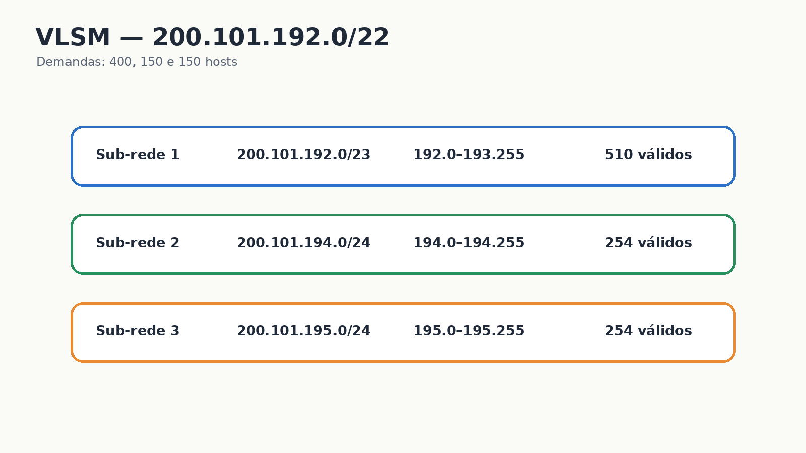

## 12.1 Estratégia

1. liste a necessidade de hosts de cada sub-rede;
2. ordene da maior para a menor;
3. encontre o menor bloco que suporta cada necessidade;
4. aloque os blocos sem sobreposição.

## 12.2 Exemplo: 400, 150 e 150 hosts

Bloco disponível:

```text
200.101.192.0/22
```

### Sub-rede 1 — 400 hosts

Precisamos de pelo menos 400 hosts válidos.

```text
2^8 - 2 = 254   insuficiente
2^9 - 2 = 510   suficiente
```

Logo:

```text
/23
```

Alocação:

```text
200.101.192.0/23
rede:      200.101.192.0
broadcast: 200.101.193.255
último:    200.101.193.254
```

### Sub-rede 2 — 150 hosts

```text
2^7 - 2 = 126   insuficiente
2^8 - 2 = 254   suficiente
```

Logo `/24`:

```text
200.101.194.0/24
broadcast: 200.101.194.255
último:    200.101.194.254
```

### Sub-rede 3 — 150 hosts

```text
200.101.195.0/24
broadcast: 200.101.195.255
último:    200.101.195.254
```

## 12.3 Endereços válidos ainda disponíveis

Se foram utilizados 400, 150 e 150 hosts:

```text
Sub-rede 1: 510 - 400 = 110
Sub-rede 2: 254 - 150 = 104
Sub-rede 3: 254 - 150 = 104
Total = 318
```

### Pegadinha

O bloco `/22` possui 1024 endereços totais. As sub-redes alocadas somam:

```text
/23 → 512
/24 → 256
/24 → 256
Total = 1024
```

Não sobrou **espaço de endereçamento não alocado**, mas sobraram **endereços válidos de host ainda sem uso dentro das sub-redes**. São conceitos diferentes.

---

## 12.4 Visualização do VLSM do exercício 400/150/150


### Por que alocar do maior para o menor?

Blocos CIDR precisam começar em fronteiras compatíveis com seu tamanho. Se você espalhar primeiro redes pequenas, pode fragmentar o espaço e depois não encontrar um intervalo **alinhado e contíguo** grande o suficiente para a maior sub-rede. Por isso a estratégia clássica de VLSM é ordenar requisitos do maior para o menor.

## 12.5 Sub-rede oculta

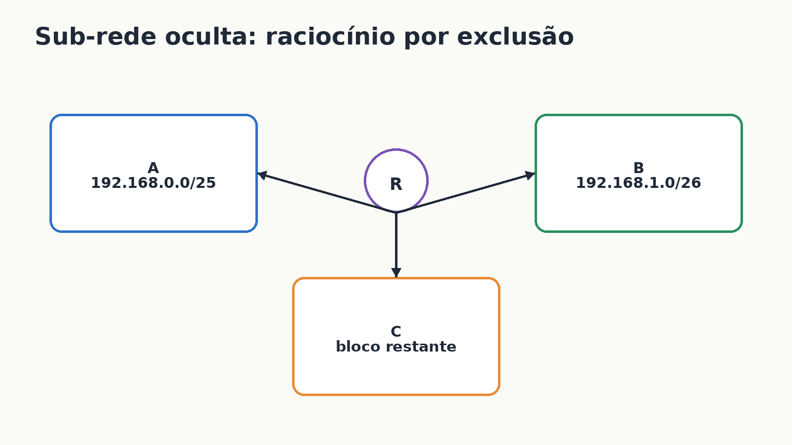

Método seguro:

1. escreva o bloco total;
2. transforme cada sub-rede conhecida em intervalo `[rede ... broadcast]`;
3. ordene os intervalos;
4. encontre a lacuna;
5. descubra qual prefixo cabe exatamente nessa lacuna;
6. confirme que o endereço inicial é múltiplo do tamanho do bloco.


## 🎯 Como o professor já cobrou este tema

O exercício real usa `200.101.192.0/22` para demandas de **400, 150 e 150 hosts**, exigindo alocação em ordem crescente. O resultado é `/23`, `/24`, `/24`. Depois ele pede maior IP válido, broadcast e endereços ainda disponíveis.

## Checklist do capítulo

- [ ] Sei alocar VLSM do maior para o menor.
- [ ] Sei identificar sub-rede oculta.
- [ ] Sei verificar alinhamento de bloco.

## Se eu lembrar apenas de 5 coisas

1. Alocar VLSM do maior para o menor.
2. Identificar sub-rede oculta.
3. Verificar alinhamento de bloco.
4. Reconhecer a ideia central e evitar a pegadinha principal.
5. Reconhecer a ideia central e evitar a pegadinha principal.
# 13. Gateway padrão, roteamento estático e tabelas de roteamento

## 13.1 Mesma sub-rede ou outra sub-rede?

Quando um host precisa enviar um pacote, ele usa sua máscara para decidir se o destino está:

- na mesma sub-rede;
- em outra sub-rede.

Se estiver na mesma rede, ele envia diretamente pelo enlace local.

Se estiver fora, envia o quadro ao **gateway padrão**.

## 13.2 Gateway padrão

É o roteador utilizado pelo host para alcançar redes que não são locais.

Nos exercícios práticos do VyOS aparecem exemplos:

```text
Rede 192.168.0.0/24 → gateway 192.168.0.254
Rede 10.0.0.0/24    → gateway 10.0.0.254
```

### ENTENDER

O pacote IP continua tendo como **destino IP** o host final. O que muda no primeiro enlace é o **MAC de destino**, que será o MAC da interface do gateway.

## 13.3 Roteamento estático

Uma rota estática é configurada manualmente.

Conceitualmente:

```text
rede de destino → próximo salto/interface
```

É adequada para cenários simples e previsíveis.

## 13.4 Tabela de roteamento

Uma tabela pode conter:

- redes diretamente conectadas;
- rotas estáticas;
- rotas aprendidas dinamicamente;
- rota padrão.

### Rota padrão

Representada como:

```text
0.0.0.0/0
```

Ela combina com qualquer destino, mas perde para rotas mais específicas.

---

## 13.5 Visual: mesma sub-rede ou outra rede?

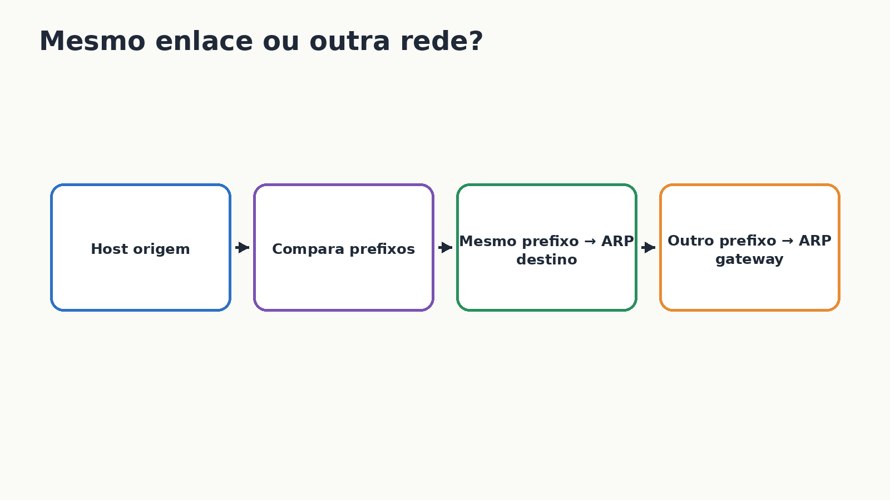

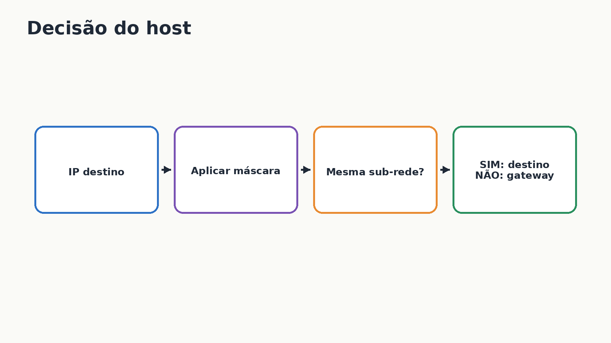

### O que muda e o que não muda

Quando A envia a um destino remoto:

- o **endereço IPv4 de destino** continua sendo o host final;
- no primeiro enlace, o **MAC de destino** é o MAC do gateway;
- cada roteador remove o quadro recebido e cria um **novo quadro** para o próximo enlace;
- o cabeçalho IPv4 é processado, e o TTL é decrementado.

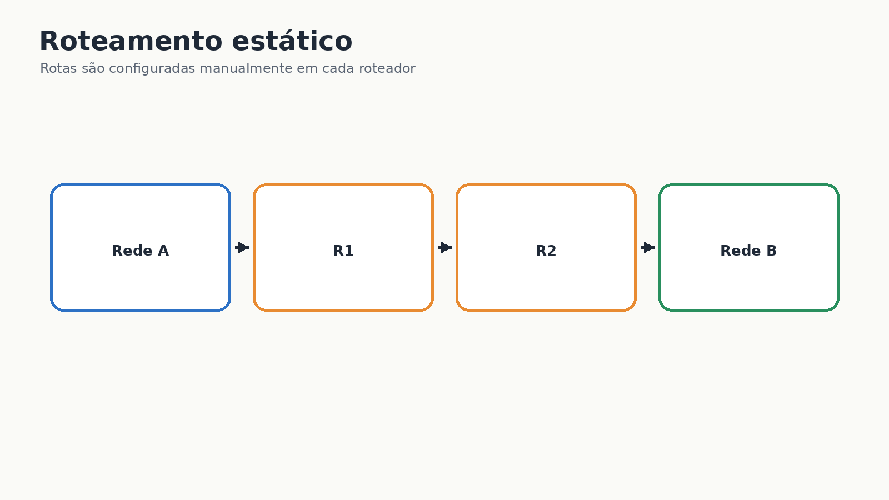

> 🧠 **Rota padrão:** `0.0.0.0/0` combina com qualquer IPv4, mas só será usada quando nenhuma rota mais específica vencer.


## 🎯 Como o professor já cobrou este tema

Há uma seção inteira de autoavaliação sobre **sub-rede e gateway padrão**: quando o host envia ao gateway, o que acontece sem gateway e como o endereço físico do gateway é descoberto.

## Checklist do capítulo

- [ ] Sei decidir mesma rede ou gateway.
- [ ] Sei explicar rota estática e rota padrão.
- [ ] Sei ler tabela de roteamento básica.

## Se eu lembrar apenas de 5 coisas

1. Decidir mesma rede ou gateway.
2. Explicar rota estática e rota padrão.
3. Ler tabela de roteamento básica.
4. Reconhecer a ideia central e evitar a pegadinha principal.
5. Reconhecer a ideia central e evitar a pegadinha principal.
# 14. Casamento do prefixo mais longo

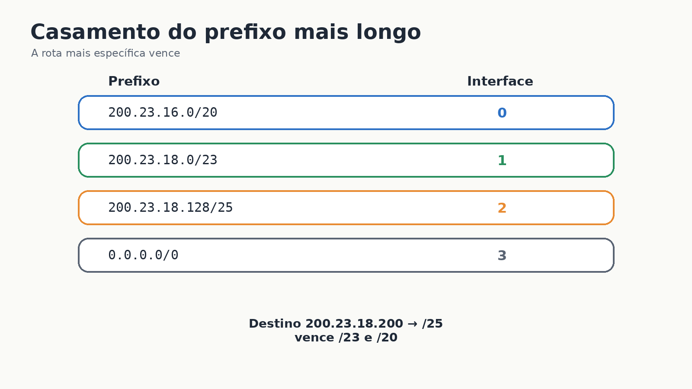

Se várias entradas da tabela combinam com o endereço de destino, o roteador escolhe a entrada com o **prefixo mais longo**, isto é, a rota mais específica.

Exemplo:

```text
200.23.16.0/20      → A
200.23.18.0/23      → B
200.23.18.128/25    → C
0.0.0.0/0           → padrão
```

Destino:

```text
200.23.18.150
```

Ele pode combinar com mais de uma rota, porém `/25` é a mais específica.

Resultado:

```text
interface C
```

### DECORAR

> **Maior número após a barra = prefixo mais específico.**

---

## 14.1 Visualização do longest prefix match


O “prefixo mais longo” não significa o endereço numericamente maior. Significa **mais bits fixos de rede**, ou seja, uma rota mais específica.

Exemplo: para `10.10.10.50`, `/24` é mais específico que `/16`, que é mais específico que `/8`. Se todos combinarem, vence `/24`.

> ⚠️ **Pegadinha:** rota padrão `/0` é a menos específica possível.


## 🎯 Como o professor já cobrou este tema

A primeira questão da seção “Encaminhamento de pacotes e roteadores” pede diretamente para explicar o **casamento do prefixo mais longo**. Prepare-se para tabelas com rotas sobrepostas: vence a correspondência com maior `/x`.

## Checklist do capítulo

- [ ] Sei aplicar longest prefix match.
- [ ] Sei explicar por que /24 é mais específico que /16.

## Se eu lembrar apenas de 5 coisas

1. Aplicar longest prefix match.
2. Explicar por que /24 é mais específico que /16.
3. Reconhecer a ideia central e evitar a pegadinha principal.
4. Reconhecer a ideia central e evitar a pegadinha principal.
5. Reconhecer a ideia central e evitar a pegadinha principal.
# 15. DHCP e obtenção de blocos de endereços

## 15.1 DHCP

**DHCP (Dynamic Host Configuration Protocol)** automatiza a configuração de hosts.

Pode fornecer:

- endereço IPv4;
- máscara;
- gateway padrão;
- servidor DNS;
- tempo de concessão.

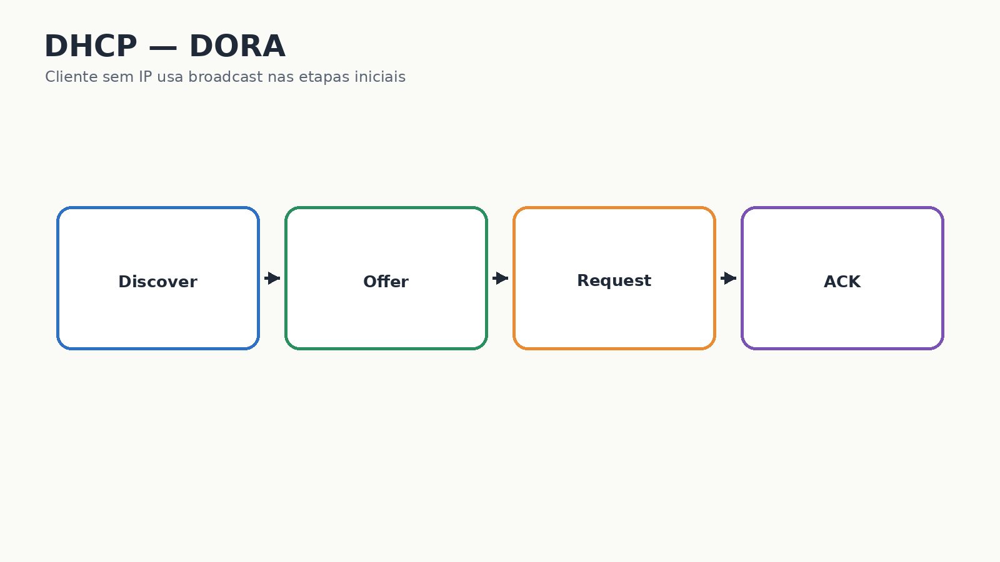

## 15.2 DORA

### 1. DHCPDISCOVER

Cliente procura servidores DHCP.

Como ainda não possui IP, os materiais apresentam o uso de:

```text
origem: 0.0.0.0
broadcast: 255.255.255.255
```

### 2. DHCPOFFER

Servidor oferece configuração, incluindo IP proposto, máscara e tempo de concessão.

### 3. DHCPREQUEST

Cliente escolhe uma oferta e solicita os parâmetros.

### 4. DHCPACK

Servidor confirma a concessão.

### DECORAR

```text
Discover → Offer → Request → ACK
D         O        R         A
```

## 15.3 DHCP Relay

Roteadores normalmente não encaminham broadcast de uma sub-rede para outra. Se o servidor DHCP está em outra rede, um **DHCP Relay** pode receber a solicitação local e encaminhá-la ao servidor.

## 15.4 Como organizações obtêm blocos IPv4

Os materiais apresentam a hierarquia de entidades e registros regionais.

Em alto nível:

```text
IANA/ICANN
   ↓
Registros Regionais (RIRs, como LACNIC)
   ↓
ISPs / organizações
   ↓
sub-blocos / interfaces
```

No Brasil, os slides citam NIC.br / Registro.br no contexto de recursos Internet.

---

## 15.5 Visualizando DORA e a distribuição de blocos


O mnemônico **DORA** ajuda a lembrar a sequência inicial típica:

1. **Discover:** cliente procura servidores;
2. **Offer:** servidor oferece configuração;
3. **Request:** cliente solicita/confirma a oferta escolhida;
4. **ACK:** servidor reconhece e confirma a concessão.

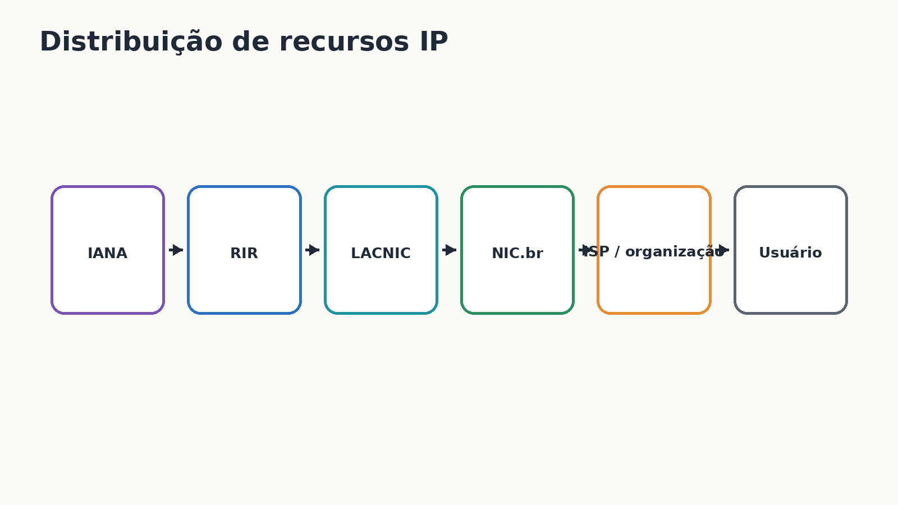

É importante separar duas perguntas:

- “Como um **host** obtém um IP?” → administração manual, DHCP etc.;
- “Como uma **rede/organização** obtém um bloco?” → hierarquia de registros e/ou alocação pelo provedor.


## 🎯 Como o professor já cobrou este tema

A autoavaliação pergunta o que é DHCP, sua função e como funciona. Relacione DHCP com endereço, máscara, gateway e DNS; saiba também por que um cliente sem configuração usa broadcast no início.

## Checklist do capítulo

- [ ] Sei decorar DORA.
- [ ] Sei explicar lease e DHCP Relay.
- [ ] Sei diferenciar IP do host de bloco da organização.

## Se eu lembrar apenas de 5 coisas

1. Decorar DORA.
2. Explicar lease e DHCP Relay.
3. Diferenciar IP do host de bloco da organização.
4. Reconhecer a ideia central e evitar a pegadinha principal.
5. Reconhecer a ideia central e evitar a pegadinha principal.
# 16. ARP

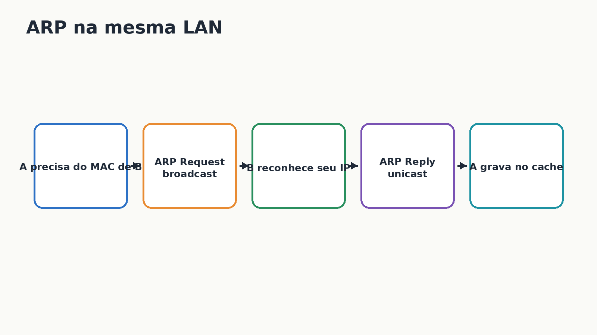

**ARP (Address Resolution Protocol)** relaciona endereço IPv4 a endereço MAC em uma rede local.

## 16.1 Situação básica

Host A conhece:

```text
IP de B = 192.168.1.20
```

mas não conhece o MAC de B.

### Etapa 1 — consultar cache ARP

Se já existe uma associação IP↔MAC válida, ela é usada.

### Etapa 2 — ARP Request

Se não existe, A envia um ARP Request em broadcast:

```text
MAC destino = FF:FF:FF:FF:FF:FF
```

Pergunta conceitual:

```text
“Quem possui 192.168.1.20?”
```

Todos os nós da LAN recebem o broadcast.

### Etapa 3 — ARP Reply

O host dono do IP responde em **unicast**, informando seu MAC.

### Etapa 4 — cache

O remetente salva temporariamente a associação.

## 16.2 Destino fora da sub-rede

Se o destino IP está fora da rede local, o host **não procura o MAC do host remoto**.

Ele procura o MAC do **gateway padrão**.

Exemplo:

```text
PC 192.168.1.10/24 quer acessar 8.8.8.8
```

O PC fará ARP para o IP do gateway, por exemplo:

```text
192.168.1.1
```

O quadro Ethernet terá MAC de destino do roteador, enquanto o datagrama IP continua destinado a `8.8.8.8`.

### Pegadinha muito provável

**ARP não atravessa roteadores como broadcast Ethernet comum.** Cada enlace resolve seus próprios endereços de camada 2.

---

## 16.3 ARP visual


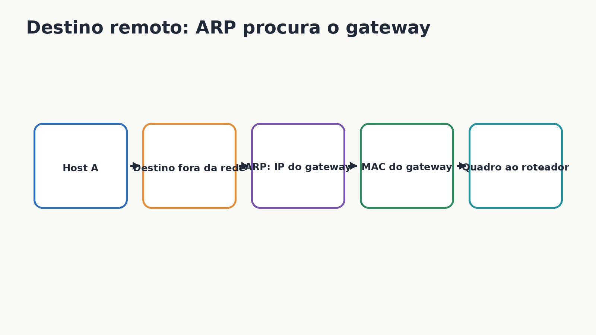

### Passo a passo quando A envia para B na mesma LAN

1. A determina, pela máscara, que B está na mesma sub-rede.
2. Procura o IPv4 de B no cache ARP.
3. Se não encontrar, envia **ARP Request em broadcast**.
4. B reconhece seu IPv4 e responde com **ARP Reply**, normalmente unicast.
5. A armazena o mapeamento temporariamente.
6. A monta o quadro Ethernet com o MAC de B.

### Quando o destino é remoto

A lógica muda no passo 1: ao perceber que o destino está em outra sub-rede, A resolve o **MAC do gateway**, não o MAC do host remoto. ARP não atravessa roteadores para descobrir o MAC de um dispositivo distante.


## 🎯 Como o professor já cobrou este tema

Uma pergunta especialmente importante: **como o host descobre o endereço físico do gateway a partir do IPv4?** A resposta em IPv4 envolve ARP. Para destino remoto, o ARP resolve o MAC do **gateway**, não do host remoto.

## Checklist do capítulo

- [ ] Sei explicar Request broadcast e Reply unicast.
- [ ] Sei explicar cache ARP.
- [ ] Sei explicar ARP para o gateway.

## Se eu lembrar apenas de 5 coisas

1. Explicar Request broadcast e Reply unicast.
2. Explicar cache ARP.
3. Explicar ARP para o gateway.
4. Reconhecer a ideia central e evitar a pegadinha principal.
5. Reconhecer a ideia central e evitar a pegadinha principal.
# 17. IPv4 privados e NAT

## 17.1 Faixas privadas

### DECORAR

```text
10.0.0.0/8
172.16.0.0/12
192.168.0.0/16
```

Esses endereços podem ser usados internamente, mas não são globalmente roteados na Internet pública.

## 17.2 NAT

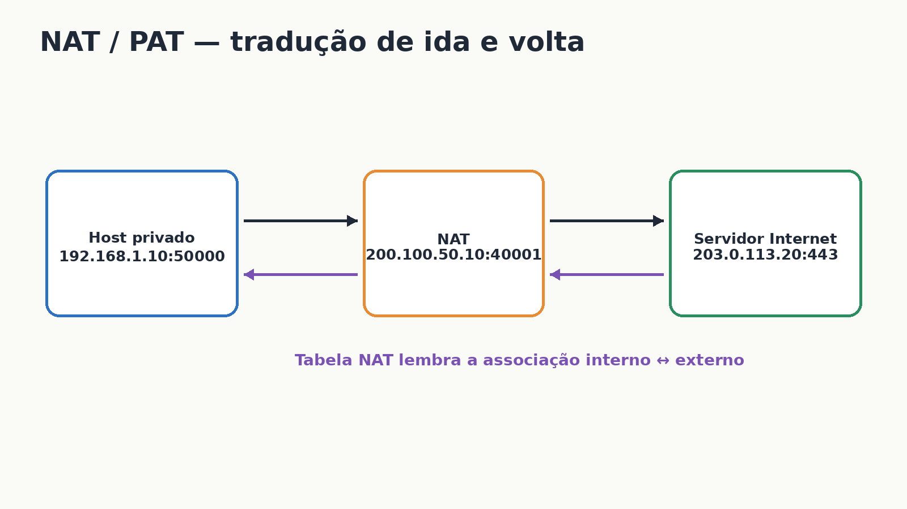

**NAT (Network Address Translation)** traduz endereços entre redes, normalmente permitindo que vários hosts privados compartilhem um endereço público.

## 17.3 Por que portas entram na tabela NAT?

Se vários dispositivos internos utilizam um único IPv4 público, apenas trocar o IP não basta para distinguir fluxos.

Por isso, o roteador mantém mapeamentos que podem envolver:

```text
IP privado + porta ↔ IP público + porta traduzida
```

Exemplo didático:

```text
10.0.0.10:51514 → 203.0.113.5:40001
10.0.0.20:52222 → 203.0.113.5:40002
```

Quando a resposta retorna para `203.0.113.5:40001`, o NAT sabe que deve encaminhá-la ao primeiro host.

## Material visual — NAT


### ENTENDER

NAT não é a mesma coisa que roteamento. Um roteador pode rotear sem NAT. NAT é uma transformação adicional do cabeçalho/mapeamento.

---

## 17.4 Blocos privados

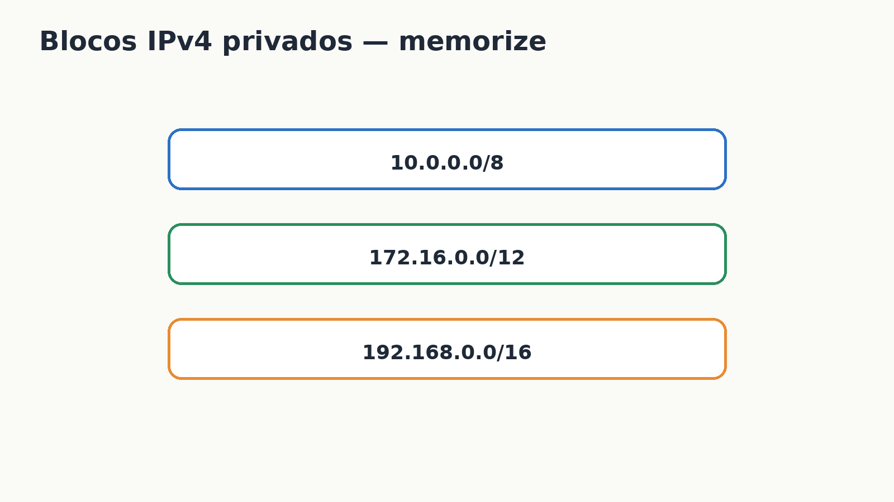

### NAT × NAPT/PAT


- **Basic NAT:** tradução de endereços;
- **NAPT/PAT:** inclui identificadores de transporte, como portas TCP/UDP, permitindo que muitos hosts compartilhem um endereço público.

> ⚠️ **Pegadinha:** NAT não “criptografa” o tráfego e não é sinônimo de firewall. Ele altera/mapeia endereços e, em NAPT, portas.


## 🎯 Como o professor já cobrou este tema

O professor possui uma seção inteira com perguntas sobre blocos privados, NAT, motivo de criação, tabela, portas, vantagens, desvantagens, servidores atrás de NAT e aplicações problemáticas. No questionário de IPv6 também aparece como pegadinha a afirmação de que NAT seria “a melhor solução definitiva” para o esgotamento do IPv4 — isso é incorreto.

## Checklist do capítulo

- [ ] Sei decorar os três blocos privados.
- [ ] Sei explicar NAT e NAPT/PAT.
- [ ] Sei não confundir NAT com firewall.

## Se eu lembrar apenas de 5 coisas

1. Decorar os três blocos privados.
2. Explicar NAT e NAPT/PAT.
3. Não confundir NAT com firewall.
4. Reconhecer a ideia central e evitar a pegadinha principal.
5. Reconhecer a ideia central e evitar a pegadinha principal.
# 18. VLANs


## 18.1 Conceito

Uma **VLAN (Virtual LAN)** cria redes locais lógicas separadas mesmo quando os dispositivos utilizam a mesma infraestrutura física de switches.

Motivos citados nos materiais:

- administração;
- segurança;
- isolamento de tráfego;
- regras de firewall;
- redução/segmentação de domínios de broadcast.

## 18.2 VLAN e sub-rede IP

Nos exercícios da disciplina, VLANs diferentes são associadas a **sub-redes diferentes**.

Exemplo:

```text
VLAN 10 → 192.168.0.0/24
VLAN 20 → 10.0.0.0/24
```

Dispositivos da mesma VLAN comunicam-se por camada 2. Dispositivos de VLANs diferentes precisam de **roteamento IP**, isto é, camada 3.

## 18.3 Porta access

Uma porta **access** pertence normalmente a uma única VLAN para conectar um host final.

Nos materiais, os quadros na porta access não carregam a informação de VLAN para o dispositivo final.

## 18.4 Porta trunk

Um **trunk** transporta tráfego de múltiplas VLANs entre equipamentos, usando tags para identificar a VLAN.

O protocolo citado é **IEEE 802.1Q**.

### DECORAR

```text
access → normalmente uma VLAN
trunk  → múltiplas VLANs + tag 802.1Q
```

## 18.5 Roteamento inter-VLAN

Uma forma mostrada no tutorial é **router-on-a-stick**:

- um enlace trunk liga switch e roteador;
- uma interface física do roteador é dividida em subinterfaces;
- cada subinterface representa uma VLAN;
- cada subinterface recebe o endereço de gateway daquela VLAN.

## Material visual — VLANs


---

## 18.6 Visualizando VLANs por etapas


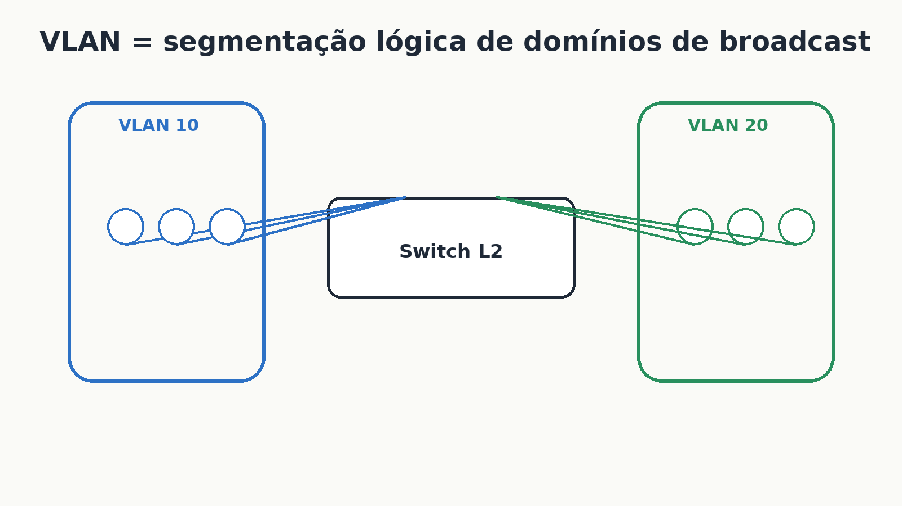


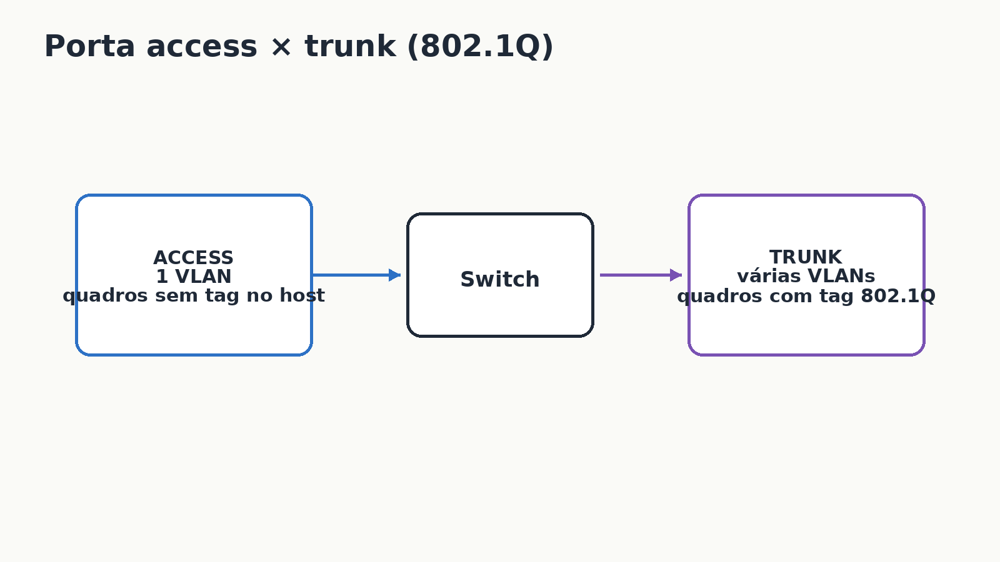

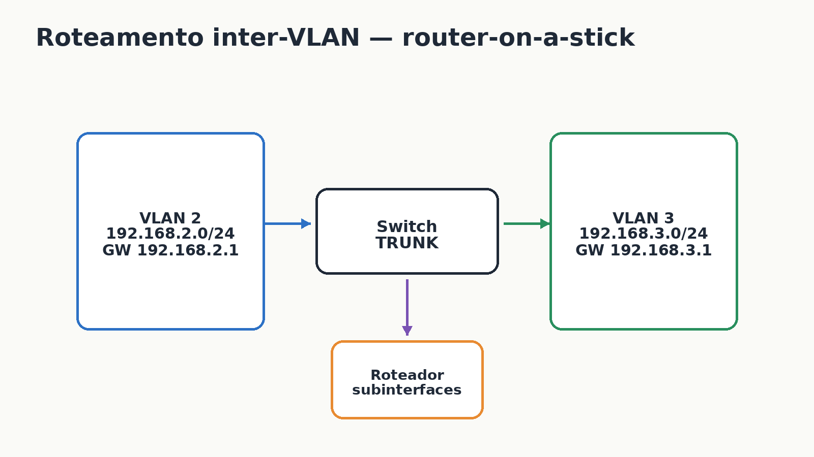

### A sequência mental correta

1. VLAN separa domínios de broadcast em camada 2.
2. Porta **access** coloca um dispositivo final em uma VLAN.
3. Link **trunk** transporta tráfego de várias VLANs entre equipamentos.
4. 802.1Q adiciona uma tag que identifica a VLAN no trunk.
5. Para VLAN 10 falar com VLAN 20, é necessário **roteamento de camada 3**.

> ⚠️ **Pegadinha:** VLAN e sub-rede são conceitos de camadas diferentes. Em projetos comuns há correspondência “uma VLAN ↔ uma sub-rede”, mas não são a mesma coisa conceitualmente.


## 🎯 Como estudar VLAN para esta prova

Use primeiro o **Exercício 4 de VLAN no tutorial GNS3/VyOS do professor**. Depois use a topologia fornecida para reconhecer portas access/untagged e trunks/tagged. A ideia central é: **cada VLAN é um domínio de broadcast lógico; VLANs diferentes precisam de roteamento para se comunicar**.

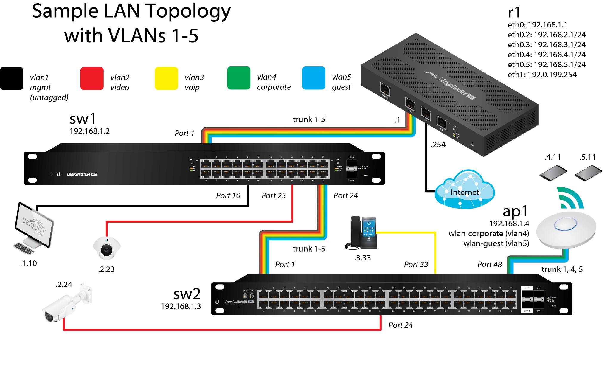

*Figura — topologia fornecida como referência para VLANs 1–5, trunks e roteamento inter-VLAN.*

## Checklist do capítulo

- [ ] Sei definir VLAN e domínio de broadcast.
- [ ] Sei diferenciar access e trunk.
- [ ] Sei explicar 802.1Q.
- [ ] Sei explicar por que inter-VLAN exige camada 3.

## Se eu lembrar apenas de 5 coisas

1. Definir VLAN e domínio de broadcast.
2. Diferenciar access e trunk.
3. Explicar 802.1Q.
4. Explicar por que inter-VLAN exige camada 3.
5. Reconhecer a ideia central e evitar a pegadinha principal.

# 19. IPv6 — histórico e motivação

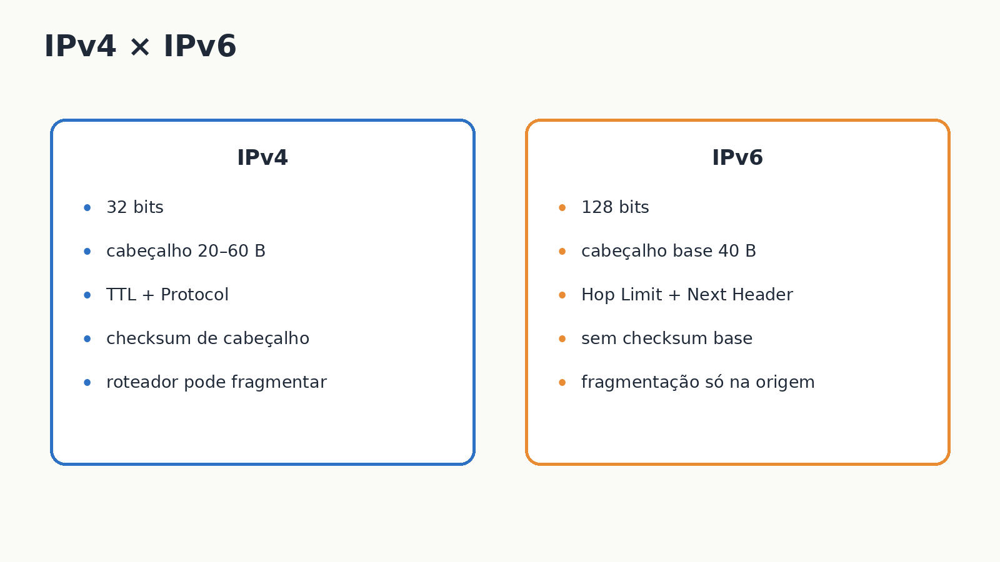

O IPv6 foi criado principalmente para resolver o problema estrutural do **esgotamento do espaço de endereços IPv4**. O IPv4 usa 32 bits, enquanto o IPv6 usa 128 bits. Nos slides do professor, CIDR, DHCP e NAT aparecem como medidas que ajudaram a prolongar a vida do IPv4, mas não substituem a necessidade de um espaço de endereçamento muito maior.

> 📌 **DECORAR:** IPv4 = 32 bits; IPv6 = 128 bits.

Os materiais também destacam objetivos de projeto como simplificação do cabeçalho, melhor suporte a configuração automática, uso de cabeçalhos de extensão e mecanismos que favorecem processamento eficiente.

### O que mudou conceitualmente

- espaço de endereçamento muito maior;
- cabeçalho base fixo de 40 bytes;
- roteadores intermediários não fragmentam;
- não existe broadcast IPv6;
- descoberta de vizinhos usa NDP/ICMPv6;
- SLAAC pode configurar endereços sem um servidor DHCPv6 obrigatório.

## 🎯 Como o professor já cobrou

Nos questionários Moodle, apareceram diretamente: entidade responsável por números IP (IANA), mudança de 32 para 128 bits, limitações do NAT, fragmentação apenas na origem e motivos para adoção do IPv6.

### Treino
1. Qual é a principal motivação histórica do IPv6?
2. Por que CIDR e NAT não eliminam definitivamente a escassez de endereços?
3. Qual afirmação é correta: “roteadores IPv6 podem fragmentar pacotes” ou “a origem é responsável pela fragmentação”?

## Resumo de prova

- IPv6 resolve a limitação do espaço IPv4.
- IPv6 possui 128 bits.
- Cabeçalho base = 40 bytes fixos.
- Fragmentação por roteadores: não.
- Broadcast: não existe.
- NDP e SLAAC são centrais na configuração e descoberta.

---

# 20. Notação e tipos de endereços IPv6

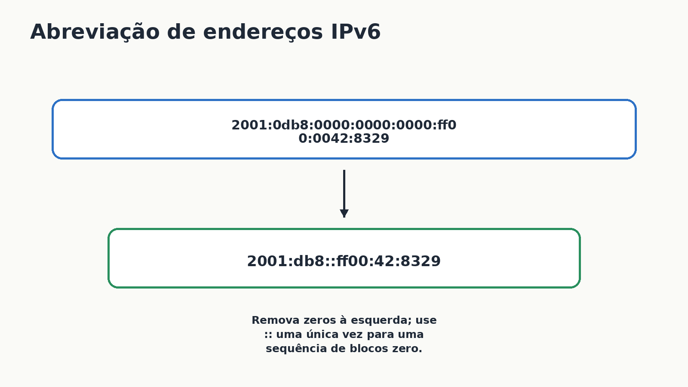

Um endereço IPv6 possui **128 bits**, normalmente representados como oito grupos de 16 bits em hexadecimal.

Exemplo completo:

`2001:0db8:0000:0000:0000:ff00:0042:8329`

Forma abreviada:

`2001:db8::ff00:42:8329`

### Regras de abreviação

1. zeros à esquerda de um grupo podem ser removidos;
2. uma sequência contínua de grupos `0000` pode ser substituída por `::`;
3. `::` só pode aparecer **uma vez** no endereço;
4. os dígitos válidos são `0–9` e `A–F` (maiúsculos ou minúsculos).

> ⚠️ **PEGADINHA:** `2001::ade1::` é inválido porque usa `::` duas vezes.

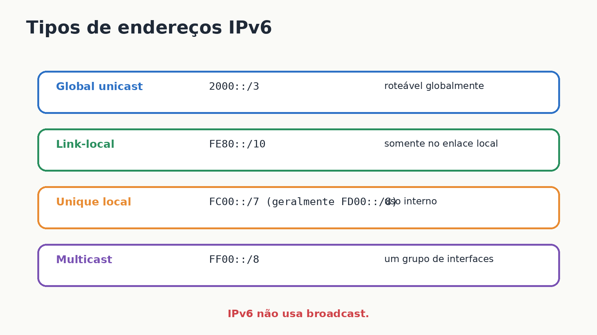

| Tipo | Prefixo/faixa | Uso principal |
|---|---|---|
| Global Unicast | `2000::/3` | roteamento global |
| Link-local | `FE80::/10` | comunicação no enlace local |
| Unique Local | `FC00::/7` (geralmente `FD00::/8`) | redes internas |
| Multicast | `FF00::/8` | comunicação com grupos |

> 📌 **DECORAR:** IPv6 **não possui broadcast**.

## 🎯 Como o professor já cobrou

As questões do Moodle apresentam endereços e perguntam qual **não é IPv6**, qual abreviação é inválida e qual tipo de endereço não existe. Espere caracteres fora de hexadecimal e uso incorreto de `::`.

### Exercícios no estilo da prova

1. Qual é válido? `2001:db8::10`, `2001::db8::10`, `2001:db8:GG::1`, `2001:db8:1:2:3:4:5:6:7`.
2. Qual tipo não existe no IPv6: unicast, multicast, anycast, broadcast?
3. Classifique `fe80::1`, `fd12:3456::1` e `2001:db8::1` pelo tipo.

**Gabarito:** 1) `2001:db8::10`; 2) broadcast; 3) link-local, unique local, global/documentação no caso de `2001:db8::/32`.

---

# 21. Sub-redes IPv6

Por convenção, redes locais IPv6 normalmente usam prefixo **/64**. Um bloco maior, como `/48` ou `/56`, pode ser subdividido em várias redes `/64`.

> 🧮 **SABER CALCULAR:** ao dividir um `/48` em 16 sub-redes iguais, precisamos de 4 bits para numerar as 16 redes (`2^4 = 16`). O novo prefixo fica `/52`.

### Exemplo da autoavaliação

Dividir `2001:db8:1::/48` em 16 blocos iguais:

- novo prefixo: `/52`;
- os 4 bits seguintes ao `/48` variam de `0` a `F`;
- blocos começam em `2001:db8:1:0000::/52`, `2001:db8:1:1000::/52`, ..., `2001:db8:1:f000::/52`.

Se o objetivo posterior for criar LANs `/64`, cada `/52` ainda contém muitas `/64`.

## 🎯 Como o professor já cobrou

A autoavaliação pergunta explicitamente como subdividir `2001:db8:1::/48` em 16 blocos iguais e qual é o tamanho padrão de prefixo usado em sub-redes IPv6.

---

# 22. Cabeçalho IPv6

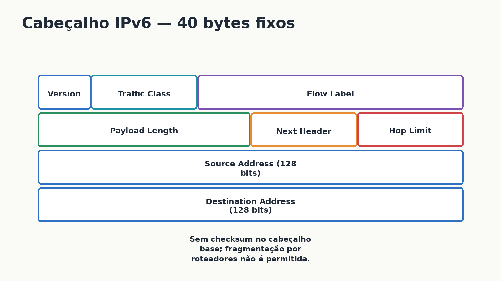

O cabeçalho base IPv6 tem **40 bytes fixos** e oito campos principais.

| Campo | Tamanho | Função |
|---|---:|---|
| Version | 4 bits | valor 6 |
| Traffic Class | 8 bits | classe/prioridade do tráfego |
| Flow Label | 20 bits | identificação de fluxo |
| Payload Length | 16 bits | tamanho da carga útil |
| Next Header | 8 bits | próximo cabeçalho/protocolo |
| Hop Limit | 8 bits | limite de saltos |
| Source Address | 128 bits | origem |
| Destination Address | 128 bits | destino |

O site IPv6.br, usado como material complementar, destaca que o cabeçalho IPv6 reduziu a quantidade de campos, removeu o checksum do cabeçalho base e usa cabeçalhos de extensão para informações opcionais.

### Por que não há checksum no cabeçalho base?

O objetivo é evitar trabalho repetido em cada roteador. A integridade também é tratada por protocolos de enlace e transporte.

### Fragmentação

Roteadores IPv6 intermediários **não fragmentam**. Se o pacote for grande demais para o enlace, ocorre sinalização ICMPv6 `Packet Too Big`; a origem ajusta o tamanho.

## 🎯 Como o professor já cobrou

A autoavaliação pergunta: campos do cabeçalho IPv6, diferenças para IPv4, tamanho em bytes, campo equivalente ao TTL e motivo da remoção do checksum. No Moodle, o campo de Classe de Tráfego e o Flow Label aparecem associados a QoS.

---

# 23. IPv4 × IPv6


| Característica | IPv4 | IPv6 |
|---|---|---|
| Endereço | 32 bits | 128 bits |
| Cabeçalho | 20–60 bytes | 40 bytes fixos |
| Checksum no cabeçalho | sim | não |
| Fragmentação por roteadores | pode ocorrer | não ocorre |
| Campo de limite | TTL | Hop Limit |
| Próximo protocolo | Protocol | Next Header |
| Broadcast | sim | não |
| Resolução de vizinho | ARP | NDP/ICMPv6 |
| Autoconfiguração | DHCP/manual | SLAAC, DHCPv6, manual |

> ⚠️ **PEGADINHA:** “IPv6 tem cabeçalho maior e por isso sempre é mais lento” é uma simplificação errada. O cabeçalho base foi redesenhado para ser fixo e mais simples de processar.

---

# 24. SLAAC

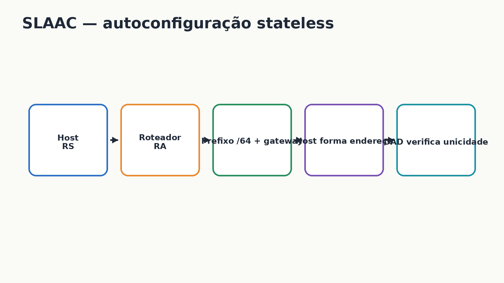

**SLAAC (Stateless Address Autoconfiguration)** permite que uma interface IPv6 forme seu próprio endereço sem que um servidor DHCPv6 precise manter a tabela de concessões de endereços.

Fluxo mental:

1. host possui endereço link-local;
2. pode enviar **Router Solicitation (RS)**;
3. roteador envia **Router Advertisement (RA)**;
4. RA informa prefixo e parâmetros;
5. host forma seu endereço;
6. mecanismos do NDP ajudam a verificar unicidade (DAD).

> 📌 **DECORAR:** SLAAC é **stateless**. DHCPv6 stateful mantém estado de concessões.

## 🎯 Como o professor já cobrou

No Moodle, a alternativa correta dizia que a autoconfiguração stateless permite configurar endereços **sem utilizar servidores DHCP**. Outra pegadinha dizia que ela não verifica unicidade — incorreto, pois há DAD.

---

# 25. NDP — Neighbor Discovery Protocol

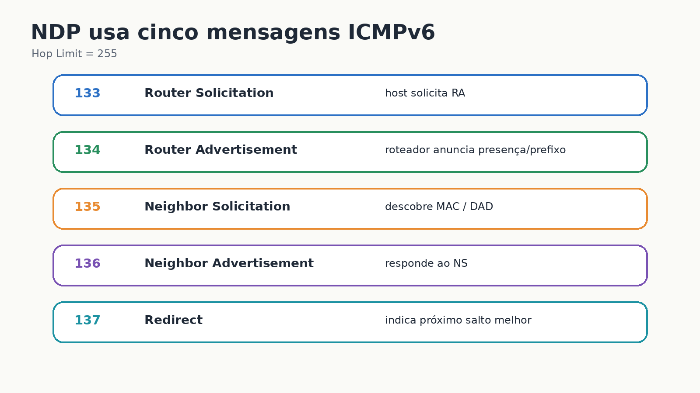

O **NDP** usa ICMPv6 e assume várias funções que no IPv4 estavam distribuídas entre ARP, Router Discovery e Redirect. Ele permite descobrir vizinhos, endereços de enlace, roteadores, prefixos, acessibilidade e auxilia a autoconfiguração.

> 📌 **DECORAR:** mensagens NDP usam **Hop Limit = 255** para ajudar a garantir que vieram do mesmo enlace.

| Mensagem | Tipo ICMPv6 | Papel |
|---|---:|---|
| Router Solicitation (RS) | 133 | host solicita anúncio do roteador |
| Router Advertisement (RA) | 134 | roteador anuncia presença/prefixos |
| Neighbor Solicitation (NS) | 135 | resolução de vizinho, acessibilidade, DAD |
| Neighbor Advertisement (NA) | 136 | resposta ao NS / anúncio do vizinho |
| Redirect | 137 | roteador indica próximo salto melhor |

### NS / NA

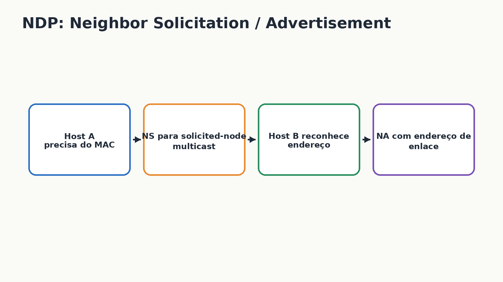

No IPv6 não se usa broadcast ARP. A descoberta de endereço da camada de enlace utiliza **Neighbor Solicitation** para um endereço multicast solicited-node e **Neighbor Advertisement** como resposta.

### RS / RA

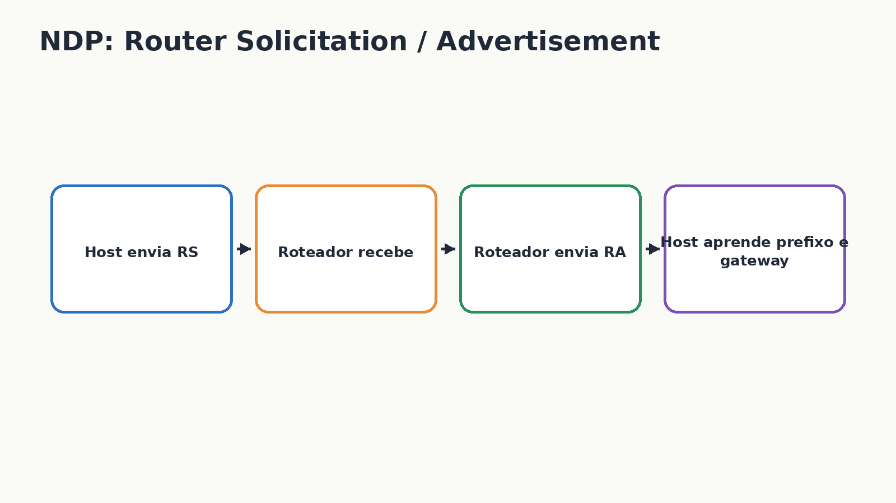

RS e RA também são essenciais para descobrir roteadores e viabilizar SLAAC.

### NDP × ARP

| IPv4 | IPv6 |
|---|---|
| ARP Request (broadcast) | Neighbor Solicitation (multicast) |
| ARP Reply | Neighbor Advertisement |
| Router Discovery separado | RS/RA no NDP |

## 🎯 Como o professor já cobrou

O questionário Parte 2 cobra fortemente NDP: quantidade de mensagens (cinco), Hop Limit 255, identificação da mensagem que **não** pertence ao NDP e associação entre RS, RA, NS, NA e Redirect.

### Exercício de associação

Associe:

A. RS  \nB. RA  \nC. NS  \nD. NA  \nE. Redirect

1. Resposta a NS.  \n2. Host pede anúncio de roteador.  \n3. Roteador anuncia prefixo/presença.  \n4. Determina endereço de enlace / acessibilidade.  \n5. Indica melhor próximo salto.

**Gabarito:** A-2, B-3, C-4, D-1, E-5.

---

# 26. Tabela rápida de CIDR

Esta tabela vale a pena memorizar para a prova.

| CIDR | Máscara | Total de endereços | Hosts válidos | Passo/bloco |
|---:|---|---:|---:|---:|
| /20 | 255.255.240.0 | 4096 | 4094 | 16 no 3º octeto |
| /21 | 255.255.248.0 | 2048 | 2046 | 8 no 3º octeto |
| /22 | 255.255.252.0 | 1024 | 1022 | 4 no 3º octeto |
| /23 | 255.255.254.0 | 512 | 510 | 2 no 3º octeto |
| /24 | 255.255.255.0 | 256 | 254 | 1 no 3º octeto |
| /25 | 255.255.255.128 | 128 | 126 | 128 no 4º |
| /26 | 255.255.255.192 | 64 | 62 | 64 no 4º |
| /27 | 255.255.255.224 | 32 | 30 | 32 no 4º |
| /28 | 255.255.255.240 | 16 | 14 | 16 no 4º |
| /29 | 255.255.255.248 | 8 | 6 | 8 no 4º |
| /30 | 255.255.255.252 | 4 | 2 | 4 no 4º |

## Tabela do último octeto da máscara

```text
0   = 00000000
128 = 10000000
192 = 11000000
224 = 11100000
240 = 11110000
248 = 11111000
252 = 11111100
254 = 11111110
255 = 11111111
```

Essa sequência ajuda tanto na conversão quanto no cálculo do tamanho do bloco.

---

## 26.1 Tabela visual

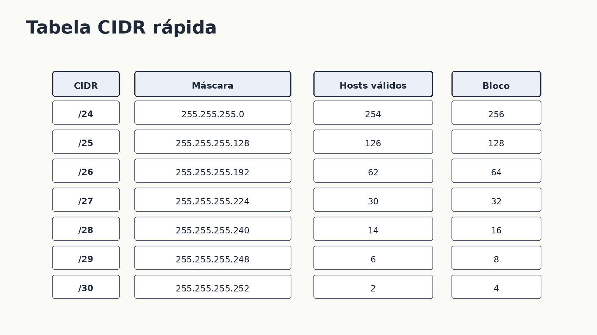

### Atalho do último octeto

Para `/25` a `/30`, decore a sequência do último octeto da máscara:

```text
/25 128
/26 192
/27 224
/28 240
/29 248
/30 252
```

Ela nasce dos bits: `10000000`, `11000000`, `11100000`...
# 27. Método rápido para questões de subnetting

Quando aparecer algo como:

> Uma sub-rede `/x` contém o IP A.B.C.D. Qual é rede/broadcast/primeiro/último?

Use este roteiro.

## Passo 1 — transforme o CIDR em máscara

Exemplo:

```text
/27 → 255.255.255.224
```

## Passo 2 — ache o octeto interessante

No `/27`, o quarto octeto é 224.

## Passo 3 — calcule o bloco

```text
256 - 224 = 32
```

## Passo 4 — encontre o intervalo que contém o IP

Se o último octeto é 150:

```text
0–31
32–63
64–95
96–127
128–159  ← aqui
160–191
...
```

## Passo 5 — responda

```text
rede      = início do intervalo
broadcast = final do intervalo
primeiro  = rede + 1
último    = broadcast - 1
```

### Dica mental

Você não precisa listar todos os blocos. Pode fazer divisão inteira:

```text
floor(150 / 32) × 32 = 4 × 32 = 128
```

Logo, rede = `.128`.

---

## 27.1 Algoritmo de prova em 20 segundos

Quando receber **IP + prefixo**:

1. converta o prefixo para a máscara;
2. ache o octeto onde a máscara não é `255` nem `0`;
3. calcule `bloco = 256 - máscara`;
4. encontre o múltiplo do bloco imediatamente menor ou igual ao octeto do IP;
5. esse múltiplo inicia a rede;
6. o próximo múltiplo menos 1 é o broadcast;
7. primeiro = rede + 1; último = broadcast - 1.

> 💡 Para `/20`, `/21`, `/22` e `/23`, o “octeto interessante” está no **terceiro octeto**, não no quarto.
# 28. Exercícios resolvidos no estilo do professor

## 28.1 Quantos hosts cabem em /23?

```text
32 - 23 = 9 bits de host
2^9 = 512 endereços
512 - 2 = 510 hosts válidos
```

**Resposta: 510**

## 28.2 Qual a máscara mínima para 10 hosts?

Procure o menor `h`:

```text
2^h - 2 >= 10
```

```text
h=3 → 6, não serve
h=4 → 14, serve
```

Prefixo:

```text
32 - 4 = 28
```

**Resposta: /28**

## 28.3 Broadcast de 10.235.32.191/20

```text
/20 = 255.255.240.0
bloco = 256 - 240 = 16
```

Terceiro octeto 32 está no bloco:

```text
32–47
```

**Resposta: 10.235.47.255**

## 28.4 Maior IP válido de 192.168.23.36/26

```text
/26 = 255.255.255.192
bloco = 64
```

36 está em:

```text
0–63
```

```text
rede = .0
broadcast = .63
último = .62
```

**Resposta: 192.168.23.62**

## 28.5 Endereço de rede de 172.20.221.17/23

```text
/23 = 255.255.254.0
bloco do terceiro octeto = 2
```

221 pertence ao bloco `220–221`.

**Resposta: 172.20.220.0**

## 28.6 Enlace /30 com uma interface 180.159.7.158

```text
/30 → blocos de 4
```

158 pertence ao bloco:

```text
156–159
```

- rede = `.156`;
- hosts = `.157` e `.158`;
- broadcast = `.159`.

Se uma interface é `.158`, a outra deve ser:

**Resposta: 180.159.7.157**

## 28.7 Máscara /20 em decimal

```text
/20 = 11111111.11111111.11110000.00000000
```

**Resposta: 255.255.240.0**

## 28.8 Planejamento de 400/150/150 hosts em 200.101.192.0/22

Máscaras:

```text
400 → /23
150 → /24
150 → /24
```

**Resposta das máscaras: `23 24 24`**

Alocações:

```text
200.101.192.0/23
200.101.194.0/24
200.101.195.0/24
```

Últimos válidos:

```text
200.101.193.254
200.101.194.254
200.101.195.254
```

---

## 28.9 Como usar estes exercícios

Não memorize as respostas. Refazer o raciocínio é o treino. Para cada exercício, tente responder primeiro em uma folha e só depois compare com a resolução. Se errar, classifique o erro:

- conversão da máscara;
- tamanho do bloco;
- localização do intervalo;
- confusão entre rede/broadcast/host;
- quantidade de bits de host;
- falta de alinhamento em VLSM.


---


# 29. Banco de exercícios por tema

Este banco segue o padrão observado nos materiais do professor: definições curtas, múltipla escolha com pegadinhas conceituais, associação e cálculos de endereçamento. Tente responder sem olhar o gabarito.

## 29.1 Arquitetura, comutação e PDU

1. Explique em duas frases por que o IP é chamado de serviço **best effort**.
2. Marque a correta: (a) repasse calcula rotas globais; (b) roteamento decide a porta de saída de cada pacote; (c) repasse usa a tabela criada pelo processo de roteamento; (d) plano de dados executa BGP para cada pacote.
3. Associe mensagem, segmento, datagrama, quadro e bits às cinco camadas.
4. Qual característica diferencia mais diretamente comutação de circuitos de comutação de pacotes?
5. Dê um exemplo de situação em que filas aparecem em um roteador.

## 29.2 ICMP, ping e traceroute

6. Qual mensagem ICMP é esperada em resposta a um Echo Request?
7. Por que um roteador envia Time Exceeded?
8. Um traceroute recebe `* * *` em um salto. Isso prova que o roteador está fora do ar? Explique.
9. O que o RTT do ping mede?
10. Qual campo IPv4 é explorado pelo traceroute clássico para revelar saltos?

## 29.3 IPv4, máscara e subnetting

11. Quantos hosts válidos cabem em `/27`?
12. Qual a menor máscara CIDR para 50 hosts?
13. Para `192.168.10.77/26`, encontre rede, primeiro host, último host e broadcast.
14. Para `10.10.34.7/20`, encontre o broadcast.
15. Qual máscara decimal corresponde a `/28`?
16. Uma sub-rede precisa de 500 hosts. Qual prefixo mínimo atende sem desperdício excessivo?
17. O endereço `172.16.31.255/20` é necessariamente broadcast? Justifique calculando o bloco.
18. Um enlace ponto a ponto tradicional precisa de 2 endereços válidos. Qual prefixo clássico é usado?
19. Converta `192.168.100.5` para 32 bits binários.
20. Em `101.100.50.172/28`, determine rede e broadcast.

## 29.4 Gateway, ARP, DHCP e NAT

21. Um host sem gateway configurado consegue falar com dispositivos da própria sub-rede? E com redes remotas?
22. Ao enviar para `8.8.8.8`, um host `192.168.1.10/24` faz ARP para qual IP?
23. Qual etapa DORA é a primeira resposta do servidor ao cliente?
24. Cite as três faixas privadas IPv4.
25. Por que NAT/PAT precisa traduzir portas quando muitos hosts compartilham um único IP público?

## 29.5 VLAN

26. Duas portas access em VLANs diferentes pertencem ao mesmo domínio de broadcast?
27. Qual é a função de uma porta trunk?
28. O padrão normalmente associado à marcação VLAN em Ethernet é qual?
29. Por que hosts de VLAN 2 e VLAN 3 precisam de roteamento para conversar?
30. Em router-on-a-stick, por que o enlace switch–roteador deve ser trunk?

## 29.6 IPv6

31. Quantos bits possui um endereço IPv6?
32. Qual endereço é inválido: `2001:db8::1`, `fe80::1234`, `2001::abcd::1`, `fd00::10`?
33. Qual tipo substitui broadcast no IPv6 para comunicação com grupos?
34. Qual prefixo caracteriza link-local?
35. Qual é o tamanho do cabeçalho base IPv6?
36. Qual campo substitui TTL?
37. Qual campo substitui o papel do campo Protocol?
38. Roteadores IPv6 podem fragmentar pacotes?
39. O que significa SLAAC ser stateless?
40. Quantas mensagens principais compõem o NDP estudado nos materiais?
41. Associe RS, RA, NS, NA e Redirect às respectivas funções.
42. Qual é o Hop Limit esperado nas mensagens NDP?
43. O NDP utiliza broadcast ARP?
44. Divida `2001:db8:1::/48` em 16 blocos: qual é o novo prefixo?
45. O IPv6 possui endereço de broadcast?

## Gabarito resumido

1. Sem garantias rígidas de entrega/ordem/atraso/vazão; tenta encaminhar o melhor possível. 2-c. 3. Aplicação-mensagem; transporte-segmento; rede-datagrama; enlace-quadro; física-bits. 4. Reserva prévia de recursos/conexão. 5. Chegadas superam temporariamente a capacidade da saída. 6. Echo Reply. 7. TTL chega a zero. 8. Não; ICMP pode ser filtrado/priorizado. 9. Ida e volta. 10. TTL. 11. 30. 12. `/26`. 13. rede `192.168.10.64`, primeiro `.65`, último `.126`, broadcast `.127`. 14. `10.10.47.255`. 15. `255.255.255.240`. 16. `/23`. 17. Não; `/20` usa blocos de 16 no terceiro octeto; 31 está no bloco 16–31, então `172.16.31.255` é broadcast desse bloco. 18. `/30`. 19. `11000000.10101000.01100100.00000101`. 20. rede `101.100.50.160`, broadcast `101.100.50.175`. 21. Sim / não. 22. IP do gateway padrão. 23. Offer. 24. `10/8`, `172.16/12`, `192.168/16`. 25. Para distinguir fluxos/hosts internos que compartilham o mesmo IP público. 26. Não. 27. Levar várias VLANs pelo mesmo enlace. 28. IEEE 802.1Q. 29. São domínios L2 distintos. 30. Precisa transportar tags de múltiplas VLANs. 31. 128. 32. `2001::abcd::1`. 33. Multicast. 34. `FE80::/10`. 35. 40 bytes. 36. Hop Limit. 37. Next Header. 38. Não, somente a origem fragmenta. 39. Sem servidor mantendo estado de concessões de endereço. 40. Cinco. 41. RS solicita roteador; RA anuncia; NS descobre vizinho/DAD; NA responde; Redirect indica caminho melhor. 42. 255. 43. Não. 44. `/52`. 45. Não.

---


# 30. Simulado final — 40 questões

**Faça sem consultar o gabarito.** O formato mistura os padrões observados nos exercícios do professor.

1. A função central da camada de rede é: (a) comunicar processos; (b) transferir pacotes da origem ao destino através de redes; (c) corrigir todo erro físico; (d) fornecer nomes DNS.
2. Em comutação de pacotes, é correto afirmar que: (a) recursos são sempre reservados; (b) pacotes nunca aguardam; (c) enlaces podem ser compartilhados estatisticamente; (d) cada fluxo precisa de circuito físico.
3. O serviço IP é chamado best effort porque: (a) garante atraso; (b) garante entrega; (c) não fornece garantias rígidas de entrega, ordem ou atraso; (d) usa circuito dedicado.
4. A PDU da camada de enlace é: (a) mensagem; (b) segmento; (c) datagrama; (d) quadro.
5. Repasse e roteamento diferem porque: (a) repasse calcula caminhos globais; (b) roteamento determina caminhos e repasse usa a tabela para cada pacote; (c) são sinônimos perfeitos; (d) repasse ocorre só no host.
6. O plano de dados de um roteador está mais relacionado a: (a) encaminhar pacotes; (b) negociar BGP humano; (c) registrar domínios; (d) distribuir blocos IP.
7. No casamento do prefixo mais longo, vence: (a) `/0`; (b) o menor prefixo numérico; (c) a correspondência com maior comprimento de prefixo; (d) a primeira linha da tabela.
8. Bloqueio HOL ocorre quando: (a) um pacote na frente da fila impede outros atrás; (b) o TTL é 0; (c) o DNS falha; (d) o host não tem IP.
9. `ping` usa principalmente: (a) ARP Request/Reply; (b) ICMP Echo Request/Reply; (c) TCP SYN/ACK; (d) DHCP Discover/Offer.
10. O traceroute revela saltos porque cada roteador: (a) aumenta TTL; (b) diminui TTL e pode enviar Time Exceeded; (c) envia ARP Reply global; (d) consulta DNS.
11. Uma `/23` possui quantos endereços válidos tradicionais? (a) 254; (b) 510; (c) 512; (d) 1022.
12. Menor prefixo para 10 hosts: (a) `/29`; (b) `/28`; (c) `/27`; (d) `/30`.
13. Broadcast de `192.168.222.150/27`: (a) `.151`; (b) `.158`; (c) `.159`; (d) `.160`.
14. Primeiro host válido da mesma rede: (a) `.128`; (b) `.129`; (c) `.130`; (d) `.131`.
15. Broadcast de `172.31.128.245/22`: (a) `172.31.128.255`; (b) `172.31.129.255`; (c) `172.31.131.255`; (d) `172.31.132.255`.
16. Máscara decimal `/26`: (a) `255.255.255.128`; (b) `255.255.255.192`; (c) `255.255.255.224`; (d) `255.255.255.240`.
17. Em `200.101.192.0/22`, uma rede para 400 hosts precisa de: (a) `/24`; (b) `/23`; (c) `/25`; (d) `/22` obrigatoriamente.
18. Endereço de rede de `101.100.50.172/28`: (a) `101.100.50.160`; (b) `.168`; (c) `.172`; (d) `.175`.
19. Broadcast da questão anterior: (a) `.174`; (b) `.175`; (c) `.176`; (d) `.191`.
20. Um host envia diretamente ao destino quando: (a) o destino está no mesmo prefixo de sub-rede; (b) sempre; (c) o destino é público; (d) DHCP está ativo.
21. Para um destino remoto, o ARP do host resolve normalmente o MAC: (a) do servidor remoto; (b) do DNS; (c) do gateway padrão; (d) do ISP Tier-1.
22. DORA significa: (a) Discover, Offer, Request, Acknowledge; (b) Data, Output, Route, ARP; (c) Discover, Open, Reply, Accept; (d) nenhum.
23. Qual é privado? (a) `8.8.8.8`; (b) `172.20.10.5`; (c) `200.1.1.1`; (d) `100.1.1.1`.
24. Uma desvantagem do NAT discutida nos materiais é: (a) amplia o espaço IPv4 para 128 bits; (b) quebra o modelo fim-a-fim; (c) elimina tabelas; (d) torna todo host público.
25. Porta trunk: (a) pertence obrigatoriamente a uma única VLAN sem tag; (b) transporta várias VLANs usando marcação; (c) não pode ligar switches; (d) substitui roteador.
26. Hosts em VLANs distintas precisam, para conversar, de: (a) somente hub; (b) roteamento L3; (c) ARP global; (d) NAT obrigatório.
27. O padrão de tagging estudado é: (a) 802.11; (b) 802.1Q; (c) 802.3u apenas; (d) IPv6.
28. IPv6 possui: (a) 32 bits; (b) 64 bits; (c) 128 bits; (d) 256 bits.
29. Qual abreviação é inválida? (a) `2001:db8::1`; (b) `::1`; (c) `2001::abcd::1`; (d) `fd00::10`.
30. Qual não é tipo de endereço IPv6? (a) unicast; (b) multicast; (c) anycast; (d) broadcast.
31. Link-local usa: (a) `FF00::/8`; (b) `FE80::/10`; (c) `2000::/3`; (d) `10::/8`.
32. Unique local está associado a: (a) `FC00::/7`; (b) `FE80::/10`; (c) `FF00::/8`; (d) `2000::/3`.
33. Cabeçalho base IPv6 tem: (a) 20 B; (b) 40 B fixos; (c) 60 B fixos; (d) tamanho sempre variável.
34. Equivalente funcional ao TTL: (a) Flow Label; (b) Traffic Class; (c) Hop Limit; (d) Payload Length.
35. Campo que indica próximo cabeçalho/protocolo: (a) Next Header; (b) IHL; (c) Header Checksum; (d) Identification.
36. Fragmentação IPv6 em roteador intermediário: (a) obrigatória; (b) permitida se MTU < pacote; (c) não permitida; (d) ocorre só com NAT.
37. SLAAC significa que: (a) sempre precisa DHCPv6 stateful; (b) o host pode autoconfigurar endereço sem servidor mantendo concessões; (c) não usa NDP; (d) só funciona em IPv4.
38. NDP usa quantas mensagens principais estudadas? (a) 3; (b) 4; (c) 5; (d) 8.
39. Neighbor Solicitation é usada para: (a) traduzir nome DNS; (b) resolver vizinho/endereço de enlace e DAD; (c) anunciar DHCP; (d) substituir BGP.
40. Mensagens NDP estudadas usam Hop Limit: (a) 1; (b) 64; (c) 128; (d) 255.

## Gabarito do simulado

1-b, 2-c, 3-c, 4-d, 5-b, 6-a, 7-c, 8-a, 9-b, 10-b, 11-b, 12-b, 13-c, 14-b, 15-c, 16-b, 17-b, 18-a, 19-b, 20-a, 21-c, 22-a, 23-b, 24-b, 25-b, 26-b, 27-b, 28-c, 29-c, 30-d, 31-b, 32-a, 33-b, 34-c, 35-a, 36-c, 37-b, 38-c, 39-b, 40-d.

## Resoluções comentadas — pontos que mais derrubam

- **Q11:** `/23` deixa 9 bits para host: `2^9 = 512`; tradicionalmente rede e broadcast não são atribuíveis → 510.
- **Q13–14:** `/27` tem bloco 32. `150` está no intervalo 128–159; rede 128, broadcast 159, hosts 129–158.
- **Q15:** `/22` equivale a `255.255.252.0`, blocos de 4 no terceiro octeto. 128–131 → broadcast 131.255.
- **Q17:** 400 hosts exigem pelo menos 402 endereços com rede/broadcast; `/23` fornece 512 totais, 510 válidos.
- **Q18–19:** `/28` tem bloco 16. 172 cai em 160–175.
- **Q21:** ARP é local; não atravessa roteadores para buscar o MAC do destino remoto.
- **Q24:** NAT conserva endereços, mas cria estado e interfere no modelo fim-a-fim.
- **Q29:** `::` só pode aparecer uma vez.
- **Q36:** no IPv6, o roteador devolve `Packet Too Big`; a origem adapta o pacote.
- **Q39:** NS/NA assumem a função de descoberta de vizinho; não é ARP broadcast.

---

# 31. Revisão de Última Hora e Checklist

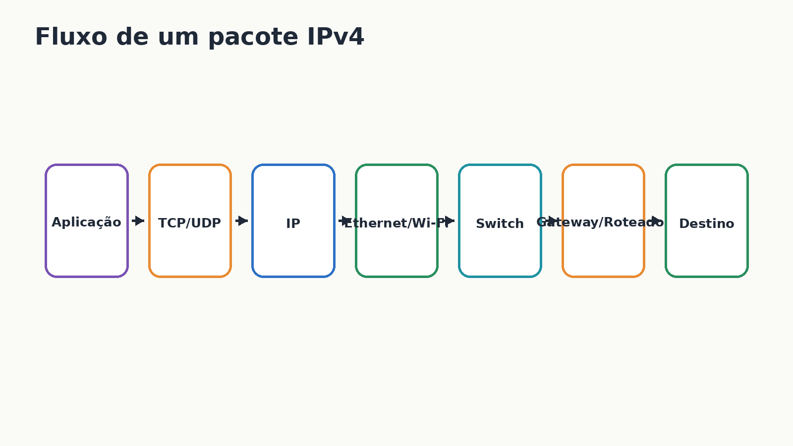

## História e arquitetura

- ARPANET: 1969.
- TCP/IP torna-se padrão na ARPANET: 1983.
- Internet = **rede de redes**.
- AS = conjunto de roteadores sob administração/política comum.
- Intra-AS: protocolos internos; inter-AS: BGP.

### Comutação

- **Pacotes:** compartilhamento estatístico, filas, atraso variável, possíveis perdas.
- **Circuitos:** reserva prévia de recursos, maior previsibilidade, possível desperdício quando o circuito fica ocioso.
- Transmissão: `d_trans = L/R`.

### Camadas e PDU

```text
Aplicação  → mensagem
Transporte → segmento
Rede       → datagrama / pacote IP
Enlace     → quadro / frame
Física     → bits
```

### Roteadores

- repasse = decisão local, plano de dados;
- roteamento = cálculo/obtenção de caminhos, plano de controle;
- entrada → elemento de comutação → saída;
- buffer cheio pode causar perda.

### ICMP, ping e traceroute

- Echo Request/Echo Reply → ping;
- TTL é decrementado por roteadores;
- TTL zero → descarte + normalmente ICMP Time Exceeded;
- traceroute aumenta TTL para revelar saltos;
- `*` = ausência de resposta àquela sonda, não prova perda fim a fim.

### IPv4 e subnetting

```text
bits_host = 32 - prefixo
endereços = 2^(bits_host)
hosts válidos = 2^(bits_host) - 2
```

```text
/24  255.255.255.0    256 / 254
/25  255.255.255.128  128 / 126
/26  255.255.255.192   64 / 62
/27  255.255.255.224   32 / 30
/28  255.255.255.240   16 / 14
/29  255.255.255.248    8 / 6
/30  255.255.255.252    4 / 2
```

Rede = primeiro endereço do bloco.  
Broadcast = último.  
Primeiro host = rede + 1.  
Último host = broadcast - 1.

### ARP

- mesma rede → ARP para o host destino;
- outra rede → ARP para o gateway;
- Request → broadcast;
- Reply → normalmente unicast.

### DHCP

**DORA:** Discover → Offer → Request → ACK.

### Privados e NAT

```text
10.0.0.0/8
172.16.0.0/12
192.168.0.0/16
```

NAT/NAPT traduz endereços e, em NAPT, portas.

### VLAN

- access → normalmente uma VLAN para host final;
- trunk → múltiplas VLANs;
- 802.1Q → tagging;
- VLANs diferentes → roteamento de camada 3.

---

## 31.1 Checklist de Véspera

## IPv4 e subnetting

- [ ] Sei converter `/20` para `255.255.240.0`.
- [ ] Sei converter `255.255.255.224` para `/27`.
- [ ] Sei calcular hosts válidos de `/23`.
- [ ] Sei achar rede, broadcast, primeiro e último host.
- [ ] Sei usar o método `256 - máscara`.
- [ ] Sei trabalhar quando o octeto interessante é o terceiro.
- [ ] Sei resolver enlace `/30`.
- [ ] Sei escolher a menor máscara para N hosts.
- [ ] Sei dividir um bloco por VLSM.
- [ ] Sei identificar uma sub-rede oculta.

## Camada de rede e roteadores

- [ ] Sei diferenciar repasse e roteamento.
- [ ] Sei diferenciar plano de dados e plano de controle.
- [ ] Sei identificar porta de entrada, comutação e saída.
- [ ] Sei explicar best effort.
- [ ] Sei aplicar longest prefix match.
- [ ] Sei explicar `0.0.0.0/0`.

## ICMP e ferramentas

- [ ] Sei explicar Echo Request e Echo Reply.
- [ ] Sei explicar TTL e Time Exceeded.
- [ ] Sei interpretar `time=`, `ttl=` e perda no ping.
- [ ] Sei interpretar um hop `* * *` corretamente.
- [ ] Sei dizer para que servem traceroute, tracepath e mtr.

## ARP, DHCP, NAT e VLAN

- [ ] Sei explicar ARP Request broadcast e Reply unicast.
- [ ] Sei explicar ARP para gateway quando destino é remoto.
- [ ] Sei recitar DORA.
- [ ] Sei decorar os três blocos privados.
- [ ] Sei explicar NAT/NAPT sem confundir com firewall.
- [ ] Sei diferenciar porta access e trunk.
- [ ] Sei explicar a função do 802.1Q.
- [ ] Sei explicar por que VLANs diferentes precisam de roteamento.

---

# 32. Fontes e aprofundamento

## 32.1 Materiais da disciplina — fonte principal

Esta apostila foi construída priorizando os arquivos fornecidos para a disciplina, entre eles:

- `introducao.pdf`;
- `redes-de-acesso.pdf`;
- `KR-1.3-nucleo-da-rede.pdf`;
- `KR-1.4-atrasos-na-rede.pdf`;
- `KR-Modelo-OSI-e-arq-da-internet.pdf`;
- `atrasos-e-ferramentas.pdf`;
- `ping.pdf`;
- `traceroute.pdf`;
- `tutorial-gns3-vyos.pdf`;
- `Intro-Camada-de-Redes-sec-5-1-Tanenbaum-2021.pdf`;
- `roteamento-slides.pdf` — Prof. Jaime Cohen;
- `kr-6ed-4-4-O-protocolo-IP.pdf`;
- `Camada-de-Redes-da-Internet-sec-5-7-Tanenbaum-2021.pdf`;
- `camada-de-redes-1.pdf` — Prof. Jaime Cohen;
- `camada-de-redes-2.pdf` — Prof. Jaime Cohen;
- `2010-Kurose-Ross-Camada-de-Enlace.pdf`;
- `edcap05.pdf`;
- `Exercícios - Endereçamento IPv4 - Parte 1 - Revisão da tentativa - Moodle do DEINFO_UEPG.pdf`.

## 32.2 Fontes web técnicas — complemento e verificação

- [RFC 791 — Internet Protocol / IPv4](https://www.rfc-editor.org/info/rfc791/)
- [RFC 792 — Internet Control Message Protocol](https://www.rfc-editor.org/info/rfc792/)
- [RFC 826 — Address Resolution Protocol (ARP)](https://www.rfc-editor.org/info/rfc826/)
- [RFC 2131 — Dynamic Host Configuration Protocol](https://www.rfc-editor.org/info/rfc2131/)
- [RFC 1918 — Address Allocation for Private Internets](https://www.rfc-editor.org/info/rfc1918/)
- [RFC 3022 — Traditional NAT](https://www.rfc-editor.org/info/rfc3022/)
- [RFC 4632 — Classless Inter-domain Routing (CIDR)](https://www.rfc-editor.org/info/rfc4632/)
- [IANA — Number Resources](https://www.iana.org/numbers)
- [Linux manual — traceroute(8)](https://man7.org/linux/man-pages/man8/traceroute.8.html)
- [Linux manual — tracepath(8)](https://man7.org/linux/man-pages/man8/tracepath.8%40%40iputils.html)
- [Cisco — Roteamento entre VLANs com 802.1Q](https://www.cisco.com/c/pt_br/support/docs/lan-switching/inter-vlan-routing/14976-50.html)
- [Internet Society — A Brief History of the Internet](https://www.internetsociety.org/wp-content/uploads/2017/09/ISOC-History-of-the-Internet_2012Oct.pdf)

## 32.3 Links fornecidos como material de apoio

- [traceroute — linux.die.net](https://linux.die.net/man/8/traceroute)
- [tracepath — linux.die.net](https://linux.die.net/man/8/tracepath)
- [mtr — linux.die.net](https://linux.die.net/man/8/mtr)
- [Traceroute — Wikipédia](https://pt.wikipedia.org/wiki/Traceroute)
- [Virtual LAN — Wikipédia](https://pt.wikipedia.org/wiki/Virtual_LAN)
- [Firewall.cx — VLAN Concept](https://www.firewall.cx/networking/vlan-networks/vlan-concept.html)
- [Firewall.cx — Inter-VLAN Routing](https://www.firewall.cx/networking/vlan-networks/intervlan-routing.html)
- [IPv6.br — Cabeçalho IPv6](https://ipv6.br/post/cabecalho/)

## 32.4 Aulas recomendadas

- 🎥 [Cálculo de Sub-rede Classe C — Hardware Redes Brasil](https://www.youtube.com/watch?v=I8srQHKA3ig) — trabalha máscara, CIDR, salto, rede, broadcast e hosts.
- 🎥 [Redes — ARP/RARP — CyberInfra](https://www.youtube.com/watch?v=Jw9I2d6gTDI) — mostra resolução IP→MAC e exemplos com roteadores.
- 🎥 [Aprendendo VLAN — Portas Trunk — Intelbras](https://www.youtube.com/watch?v=OjY1E_BgFdo) — revisão prática de trunk e 802.1Q.

---

## Nota sobre o escopo

IPv6 aparece em alguns materiais e no link do IPv6.br, mas **não foi transformado em capítulo principal** porque a lista da segunda avaliação enfatiza IPv4. Ele é citado apenas quando ajuda a comparar fragmentação/cabeçalhos e evitar confusões.


## 32.5 Materiais adicionados para esta segunda avaliação

Fontes principais de cobrança:

- `exercicios-camada-de-redes.pdf` — exercícios de autoavaliação do Prof. Jaime Cohen;
- `Exercícios - Endereçamento IPv4 - Parte 1 ... Moodle`;
- `Endereçamento IPv4 - Exercícios - Parte 2 ... Moodle`;
- `Questionário sobre IPv6 - Parte 1 ... Moodle`;
- `Questionário sobre IPv6 - Parte 2 ... Moodle`;
- `ipv6.pdf` — Endereçamento IPv6, Prof. Jaime Cohen;
- `IPv6-funcionalidades-basicas-CGIBR.pdf`;
- `tutorial-gns3-vyos(1).pdf` — atividades práticas, incluindo VLAN e IPv6.

Complementos fornecidos:

- IPv6.br — Cabeçalho IPv6: https://ipv6.br/post/cabecalho/
- Wikipedia — VLAN: https://en.wikipedia.org/wiki/VLAN
- Firewall.cx — conceito de VLAN e inter-VLAN routing.

> 🎯 Para a prova, em caso de diferença de enfoque, **prevalece o material do professor**.
